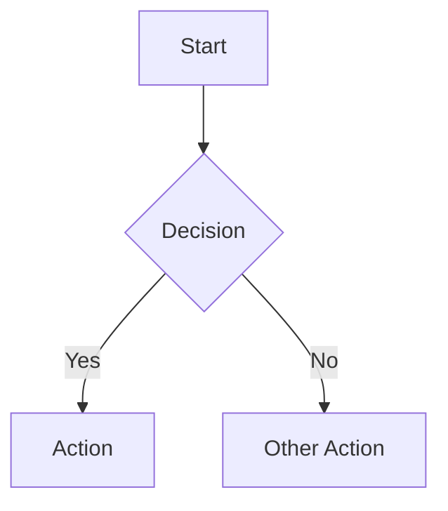

# AFC Odoo - Coding Standards & Patterns

## Odoo Module Development

### Model Definitions

```python
from odoo import models, fields, api, _
from odoo.exceptions import ValidationError, UserError

class AfcCloseCalendar(models.Model):
    _name = 'afc.close.calendar'
    _description = 'AFC Close Calendar'
    _inherit = ['mail.thread', 'mail.activity.mixin']
    _order = 'period_start desc'

    # Fields follow this order: char, text, selection, boolean, numeric, date, relational
    name = fields.Char(required=True, tracking=True)
    state = fields.Selection([
        ('draft', 'Draft'),
        ('active', 'Active'),
        ('closed', 'Closed'),
        ('locked', 'Locked'),
    ], default='draft', tracking=True)

    # Computed fields
    progress_percent = fields.Float(compute='_compute_progress', store=True)

    @api.depends('task_ids.state')
    def _compute_progress(self):
        for record in self:
            # Implementation
            pass
```

### Security Patterns

```xml
<!-- ir.model.access.csv format -->
id,name,model_id:id,group_id:id,perm_read,perm_write,perm_create,perm_unlink
access_afc_calendar_user,afc.calendar.user,model_afc_close_calendar,group_afc_user,1,1,1,0
access_afc_calendar_manager,afc.calendar.manager,model_afc_close_calendar,group_afc_manager,1,1,1,1
```

### State Machine Constraints

```python
# Always enforce state transitions via methods, not direct assignment
def action_activate(self):
    for record in self:
        if record.state != 'draft':
            raise UserError(_("Can only activate from Draft state"))
        record.state = 'active'
```

## N8N Workflow Patterns

### Webhook Endpoints

```javascript
// Always validate incoming data
if (!$json.id || !$json.action) {
    throw new Error('Missing required fields: id, action');
}
```

### Error Handling

```javascript
// Use structured error responses
return {
    success: false,
    error: 'sod_violation',
    message: 'Separation of Duties conflict detected',
    details: { user_id, conflict_rule }
};
```

### SoD Validation Pattern

```javascript
// Before any financial action
const sodCheck = await $http.post('/api/v2/afc.sod.check', {
    user_id: current_user,
    action: 'post_journal_entry',
    document_id: entry.id
});

if (sodCheck.has_conflict) {
    // Block and alert
}
```

## Documentation Standards

### Markdown Structure

```markdown
# Document Title

## Overview
Brief description of the document purpose.

---

## 1. First Major Section

### 1.1 Subsection
Content with proper hierarchy.

| Column 1 | Column 2 |
|----------|----------|
| Data     | Data     |

---

## 2. Second Major Section
...
```

### Code Block Languages

- Python: `python`
- JavaScript: `javascript`
- SQL: `sql`
- Bash: `bash`
- YAML: `yaml`
- XML: `xml`
- JSON: `json`

### Mermaid Diagrams

```markdown

```

## Git Commit Messages

```
<type>(<scope>): <description>

Types: feat, fix, docs, refactor, test, chore
Scope: module name, section, or feature area

Examples:
feat(afc_core): Add multi-company support
fix(sod): Correct conflict detection for GL posting
docs(deployment): Add N8N backup procedures
```

## Security Requirements

1. **No Raw SQL**: Always use Odoo ORM
2. **Domain Rules**: Enforce multi-company isolation
3. **Audit Trails**: Log all financial transactions
4. **Immutability**: Never delete audit records
5. **SoD Enforcement**: Check at transaction level
