# AFC Odoo Database Schema (DBML/ERD)

**Document Version**: 1.0
**Last Updated**: 2025-01-29
**Owner**: IT Market Director
**Classification**: Internal - Technical Reference

---

## Executive Summary

This document provides the complete database schema for the AFC (Advanced Financial Closing) Odoo modules in DBML (Database Markup Language) format, suitable for visualization at [dbml.io](https://dbml.io).

### Schema Statistics

| Metric | Count |
|--------|-------|
| Total Tables | 30 |
| Total Fields | 350+ |
| Primary Keys | 30 |
| Foreign Keys | 40+ |
| Unique Constraints | 15+ |
| Computed Columns | 25+ |
| Indexes | 40+ |
| State Machines | 8 |

### Module Breakdown

| Module | Tables | Description |
|--------|--------|-------------|
| Core (afc_close_manager) | 9 | Close calendar, tasks, GL posting |
| Philippine Localization | 8 | BIR forms, tax engine |
| Separation of Duties | 7 | Roles, conflicts, audit trail |
| RAG Copilot | 8 | Knowledge base, embeddings, chat |

---

## Part 1: Complete DBML Schema

```dbml
// ============================================================================
// AFC ODOO - Advanced Financial Closing Module
// Complete Database Schema (DBML Format)
// ============================================================================
// Visualize at: https://dbml.io/editor
// Database: PostgreSQL 13+
// ============================================================================

Project AFC_ODOO {
  database_type: 'PostgreSQL'
  Note: 'Advanced Financial Closing Module for Odoo CE 18'
}

// ============================================================================
// CORE MODULE: afc_close_manager
// ============================================================================

Table afc_close_calendar {
  id Integer [pk]
  name String [not null, unique]
  company_id Integer [not null, ref: > res_company.id]
  fiscal_year_start Date
  fiscal_year_end Date
  state String [not null, default: "draft", note: "draft|active|closed|locked"]
  opening_date Date [note: "Computed from earliest task start"]
  closing_date Date [note: "Computed from latest task completion"]
  status_progress Float [default: 0, note: "0-100% completion"]
  locked_datetime Timestamp
  locked_user_id Integer [ref: > res_users.id]
  notes Html
  create_date Timestamp [default: "NOW()"]
  create_uid Integer [not null, ref: > res_users.id]
  write_date Timestamp [default: "NOW()"]
  write_uid Integer [ref: > res_users.id]

  Indexes {
    (name, company_id) [unique, type: hash]
    company_id [type: hash]
    state [type: hash]
    create_date [type: btree]
  }

  Note: "Parent calendar for a financial closing period."
}

Table afc_closing_task {
  id Integer [pk]
  calendar_id Integer [not null, ref: > afc_close_calendar.id]
  sequence Integer [default: 1, note: "Task execution order"]
  name String [not null]
  description Html
  task_type String [not null, note: "preparation|execution|review|sign_off"]
  state String [not null, default: "pending", note: "pending|in_progress|review|completed|overdue"]
  assigned_to_id Integer [not null, ref: > res_users.id]
  preparer_id Integer [ref: > res_users.id, note: "SoD: Preparer role"]
  reviewer_id Integer [ref: > res_users.id, note: "SoD: Must ≠ preparer"]
  approver_id Integer [ref: > res_users.id, note: "SoD: Must ≠ preparer AND reviewer"]
  due_date Date [not null]
  actual_completion Date
  percentage_complete Float [default: 0, note: "0-100%"]
  overdue Boolean [note: "Computed: due_date < TODAY & state != completed"]
  create_date Timestamp [default: "NOW()"]
  create_uid Integer [not null, ref: > res_users.id]
  write_date Timestamp [default: "NOW()"]
  write_uid Integer [ref: > res_users.id]

  Indexes {
    calendar_id [type: hash]
    state [type: hash]
    assigned_to_id [type: hash]
    due_date [type: btree]
    (preparer_id, reviewer_id, approver_id) [unique, type: hash, note: "Four-Eyes constraint"]
  }

  Note: "Individual closing task with Four-Eyes principle enforcement"
}

Table afc_closing_task_dependency {
  id Integer [pk]
  task_id Integer [not null, ref: > afc_closing_task.id]
  dependency_task_id Integer [not null, ref: > afc_closing_task.id]
  order_index Integer

  Note: "Task dependencies for sequential execution"
}

Table afc_gl_posting {
  id Integer [pk]
  name String [not null, unique, note: "Auto-generated reference (POD-2024-00001)"]
  task_id Integer [not null, ref: > afc_closing_task.id]
  calendar_id Integer [not null, ref: > afc_close_calendar.id]
  company_id Integer [not null, ref: > res_company.id]
  posting_date Date [not null]
  description String [not null]
  move_id Integer [ref: > account_move.id, note: "Link to GL account.move"]
  state String [not null, default: "draft", note: "draft|posted|reversed"]
  total_debit Decimal [note: "Computed: SUM(debit) from lines"]
  total_credit Decimal [note: "Computed: SUM(credit) from lines"]
  is_balanced Boolean [note: "Computed: total_debit = total_credit"]
  reversal_of_id Integer [ref: > afc_gl_posting.id, note: "For reversal tracking"]
  currency_id Integer [ref: > res_currency.id]
  posted_by Integer [ref: > res_users.id]
  posted_date Timestamp
  create_date Timestamp [default: "NOW()"]
  create_uid Integer [not null, ref: > res_users.id]
  write_date Timestamp [default: "NOW()"]
  write_uid Integer [ref: > res_users.id]

  Indexes {
    name [unique, type: hash]
    task_id [type: hash]
    calendar_id [type: hash]
    company_id [type: hash]
    state [type: hash]
    move_id [type: hash]
    posting_date [type: btree]
    create_date [type: btree]
  }

  Note: "GL posting with balance validation (debit = credit)"
}

Table afc_gl_posting_line {
  id Integer [pk]
  posting_id Integer [not null, ref: > afc_gl_posting.id]
  sequence Integer [default: 1]
  account_id Integer [not null, ref: > account_account.id]
  debit Decimal [default: 0, note: "Must be ≥ 0"]
  credit Decimal [default: 0, note: "Must be ≥ 0"]
  name String [note: "Line description"]
  analytic_account_id Integer [ref: > account_analytic_account.id]
  company_currency_id Integer [ref: > res_currency.id]
  create_date Timestamp [default: "NOW()"]
  create_uid Integer [ref: > res_users.id]
  write_date Timestamp [default: "NOW()"]
  write_uid Integer [ref: > res_users.id]

  Indexes {
    posting_id [type: hash]
    account_id [type: hash]
    (posting_id, account_id) [type: hash]
  }

  Note: "Individual debit/credit lines. Debit XOR Credit (one must be non-zero)"
}

Table afc_intercompany {
  id Integer [pk]
  name String [not null, unique, note: "Auto-generated reference"]
  from_company_id Integer [not null, ref: > res_company.id]
  to_company_id Integer [not null, ref: > res_company.id]
  amount Decimal [not null, note: "Settlement amount > 0"]
  currency_id Integer [ref: > res_currency.id]
  state String [not null, default: "draft", note: "draft|approved|invoiced|settled|reversed"]
  description String
  invoice_id Integer [ref: > account_move.id, note: "Generated AP/AR invoice"]
  gl_posting_id Integer [ref: > afc_gl_posting.id, note: "Settlement GL posting"]
  approval_date Timestamp
  approved_by_id Integer [ref: > res_users.id]
  invoice_date Date
  settlement_date Date
  create_date Timestamp [default: "NOW()"]
  create_uid Integer [not null, ref: > res_users.id]
  write_date Timestamp [default: "NOW()"]
  write_uid Integer [ref: > res_users.id]

  Indexes {
    from_company_id [type: hash]
    to_company_id [type: hash]
    state [type: hash]
    invoice_id [type: hash]
    gl_posting_id [type: hash]
  }

  Note: "Intercompany settlement with automatic invoice & GL posting"
}

Table afc_document {
  id Integer [pk]
  name String [not null]
  category String [note: "support|evidence|approval|other"]
  task_id Integer [ref: > afc_closing_task.id]
  calendar_id Integer [not null, ref: > afc_close_calendar.id]
  description Html
  retention_period Integer [note: "Months to retain document"]
  is_confidential Boolean [default: false]
  uploaded_by Integer [ref: > res_users.id]
  uploaded_date Timestamp
  last_accessed Timestamp
  create_date Timestamp [default: "NOW()"]
  create_uid Integer [ref: > res_users.id]
  write_date Timestamp [default: "NOW()"]
  write_uid Integer [ref: > res_users.id]

  Indexes {
    calendar_id [type: hash]
    task_id [type: hash]
    category [type: hash]
  }

  Note: "Document management for closing evidence"
}

Table afc_compliance_checklist {
  id Integer [pk]
  name String [not null]
  calendar_id Integer [not null, ref: > afc_close_calendar.id]
  compliance_type String [note: "sox_404|coso|iso_27001|other"]
  overall_status String [note: "Computed: not_started|in_progress|completed"]
  create_date Timestamp [default: "NOW()"]
  create_uid Integer [ref: > res_users.id]
  write_date Timestamp [default: "NOW()"]
  write_uid Integer [ref: > res_users.id]

  Note: "Compliance checklist for closing (SOX 404, COSO, ISO 27001)"
}

Table afc_compliance_item {
  id Integer [pk]
  checklist_id Integer [not null, ref: > afc_compliance_checklist.id]
  description String [not null]
  responsible_id Integer [ref: > res_users.id]
  due_date Date
  completion_date Date
  status String [default: "pending", note: "pending|completed|waived"]
  create_date Timestamp [default: "NOW()"]
  create_uid Integer [ref: > res_users.id]
  write_date Timestamp [default: "NOW()"]
  write_uid Integer [ref: > res_users.id]

  Note: "Individual compliance item with evidence tracking"
}

// ============================================================================
// PHILIPPINE LOCALIZATION MODULE: afc_close_manager_ph
// ============================================================================

Table bir_form_1700 {
  id Integer [pk]
  name String [not null, unique, note: "BIR reference (BIR-2024-12345)"]
  tin String [not null, note: "Tax ID Number (123-456-789-000)"]
  taxpayer_name String [not null]
  company_id Integer [ref: > res_company.id]
  fiscal_year Integer [not null, note: "2024, 2025, etc."]
  gross_income Decimal [note: "Computed: SUM(income_lines)"]
  deductible_expenses Decimal [note: "Computed: SUM(expenses)"]
  taxable_income Decimal [note: "Computed: gross_income - deductible_expenses"]
  total_tax Decimal [note: "Computed via ph_tax_engine with 2024 brackets"]
  paid_tax Decimal [default: 0, note: "Quarterly payments"]
  balance_due Decimal [note: "Computed: total_tax - paid_tax"]
  filing_date Date
  filed_status String [default: "draft", note: "draft|filed|accepted|rejected"]
  pdf_report Binary [note: "Generated PDF form"]
  create_date Timestamp [default: "NOW()"]
  create_uid Integer [not null, ref: > res_users.id]
  write_date Timestamp [default: "NOW()"]
  write_uid Integer [ref: > res_users.id]

  Indexes {
    tin [type: hash]
    fiscal_year [type: hash]
    filed_status [type: hash]
  }

  Note: "BIR Form 1700 (Annual Income Tax Return) with 2024 progressive tax brackets"
}

Table bir_form_1700_line {
  id Integer [pk]
  form_id Integer [not null, ref: > bir_form_1700.id]
  sequence Integer [default: 1]
  income_source String
  income_amount Decimal
  expenses Decimal
  net_income Decimal [note: "Computed: income_amount - expenses"]

  Note: "Individual income line for Form 1700"
}

Table bir_form_1601c {
  id Integer [pk]
  name String [not null, unique]
  month String [not null, note: "01-12"]
  year Integer [not null]
  company_id Integer [ref: > res_company.id]
  tin String [not null]
  withholding_type String [note: "compensation|business_income|interest|dividends"]
  employee_count Integer [note: "For compensation withholding"]
  total_withholding Decimal [note: "Computed: SUM(withholding amounts)"]
  filed_status String [default: "draft", note: "draft|filed|accepted"]
  filing_deadline Date [note: "20th of next month"]
  days_until_deadline Integer [note: "Computed: deadline - today"]
  penalties_applicable Boolean [note: "Computed: if past deadline"]
  create_date Timestamp [default: "NOW()"]
  create_uid Integer [ref: > res_users.id]
  write_date Timestamp [default: "NOW()"]
  write_uid Integer [ref: > res_users.id]

  Note: "BIR Form 1601-C (Monthly Withholding Tax Return) with deadline tracking"
}

Table bir_form_1601c_line {
  id Integer [pk]
  form_id Integer [not null, ref: > bir_form_1601c.id]
  sequence Integer [default: 1]
  payee_name String
  amount_paid Decimal
  withholding_rate Float [note: "% or fixed amount"]
  withholding_amount Decimal [note: "Computed: amount_paid × withholding_rate"]
  senior_citizen Boolean [note: "Apply special rates"]
  pwd_disabled Boolean [note: "Person With Disability"]

  Note: "Withholding line with senior citizen/PWD rate handling"
}

Table bir_form_2550q {
  id Integer [pk]
  name String [not null, unique]
  quarter String [not null, note: "Q1|Q2|Q3|Q4"]
  year Integer [not null]
  company_id Integer [ref: > res_company.id]
  tin String [not null]
  total_input_vat Decimal [note: "Computed: SUM(input VAT)"]
  total_output_vat Decimal [note: "Computed: SUM(output VAT)"]
  net_vat_payable Decimal [note: "Computed: output - input if > 0"]
  net_vat_refundable Decimal [note: "Computed: input - output if > 0"]
  refund_claimed Decimal [note: "User selection from refundable"]
  vat_payable Decimal [note: "Computed: net_vat_payable - refund_claimed"]
  penalties Decimal [note: "Auto-calculated if late"]
  total_payment Decimal [note: "Computed: vat_payable + penalties"]
  filing_status String [default: "draft", note: "draft|filed|accepted|paid"]
  filing_deadline Date [note: "20th of following month"]
  days_until_deadline Integer [note: "Computed"]
  create_date Timestamp [default: "NOW()"]
  create_uid Integer [ref: > res_users.id]
  write_date Timestamp [default: "NOW()"]
  write_uid Integer [ref: > res_users.id]

  Note: "BIR Form 2550Q (Quarterly VAT Return) with refund logic"
}

Table bir_form_2550q_input_vat {
  id Integer [pk]
  form_id Integer [not null, ref: > bir_form_2550q.id]
  invoice_date Date
  supplier String
  invoice_number String
  amount_subject_to_vat Decimal
  vat_amount Decimal
  vat_rate Float [default: 0.12, note: "12% standard rate"]

  Note: "Input VAT detail line"
}

Table bir_form_2550q_output_vat {
  id Integer [pk]
  form_id Integer [not null, ref: > bir_form_2550q.id]
  invoice_date Date
  customer String
  sales_amount Decimal
  vat_rate Float [note: "12%, 0%, exempt"]
  vat_amount Decimal

  Note: "Output VAT detail line"
}

Table ph_tax_config {
  id Integer [pk]
  company_id Integer [not null, unique, ref: > res_company.id]
  tax_year Integer [not null]
  form_1700_brackets Json [note: "2024 brackets: {0-250k: 0%, 250k-400k: 15%, ...}"]
  form_1601c_rates Json [note: "Withholding rates by type"]
  form_2550q_vat_rate Float [default: 0.12]
  senior_citizen_exemption Decimal [default: 250000]
  pwd_exemption Decimal [default: 100000]
  ebirforms_username String
  ebirforms_api_url String
  automatic_filing_enabled Boolean [default: false]

  Note: "Philippine localization configuration with 2024 tax rates"
}

// ============================================================================
// SEPARATION OF DUTIES (SAP GRC) MODULE: afc_sod_controls
// ============================================================================

Table sod_role {
  id Integer [pk]
  name String [not null, unique, note: "Preparer, Reviewer, Approver, etc."]
  description Html
  code String [unique, note: "PE, RE, AP, etc."]
  is_system_role Boolean [default: true, note: "8 predefined system roles"]
  active Boolean [default: true]
  create_date Timestamp [default: "NOW()"]
  create_uid Integer [ref: > res_users.id]
  write_date Timestamp [default: "NOW()"]
  write_uid Integer [ref: > res_users.id]

  Note: "SoD role definitions (8 system roles)"
}

Table sod_permission {
  id Integer [pk]
  role_id Integer [not null, ref: > sod_role.id]
  model_id Integer [not null, ref: > ir_model.id]
  perm_read Boolean [default: true]
  perm_write Boolean [default: false]
  perm_create Boolean [default: false]
  perm_unlink Boolean [default: false]

  Note: "Model-level permissions per role"
}

Table sod_conflict_matrix {
  id Integer [pk]
  name String [not null, unique, note: "Preparer ≠ Approver"]
  rule_type String [note: "mutual_exclusive|required_separation"]
  role1_id Integer [not null, ref: > sod_role.id]
  role2_id Integer [not null, ref: > sod_role.id]
  description Html
  severity String [note: "critical|high|medium"]
  is_active Boolean [default: true]
  create_date Timestamp [default: "NOW()"]
  create_uid Integer [ref: > res_users.id]
  write_date Timestamp [default: "NOW()"]
  write_uid Integer [ref: > res_users.id]

  Note: "7 predefined conflict rules (SoD enforcement matrix)"
}

Table sod_conflict_detection {
  id Integer [pk]
  conflict_matrix_id Integer [not null, ref: > sod_conflict_matrix.id]
  user_id Integer [not null, ref: > res_users.id]
  detected_date Timestamp [default: "NOW()"]
  status String [default: "active", note: "active|acknowledged|resolved|waived"]
  resolution_id Integer [ref: > sod_exception.id]
  create_date Timestamp [default: "NOW()"]
  write_date Timestamp [default: "NOW()"]

  Indexes {
    (conflict_matrix_id, user_id) [unique, type: hash]
  }

  Note: "Real-time conflict detection (user has conflicting roles)"
}

Table sod_exception {
  id Integer [pk]
  name String [not null, unique, note: "Exception reference"]
  conflict_id Integer [not null, ref: > sod_conflict_detection.id]
  requested_by Integer [not null, ref: > res_users.id]
  justified_reason Html [not null]
  exception_scope String [note: "single_transaction|time_period"]
  expiry_date Date [note: "If time_period scope"]
  approval_status String [default: "pending", note: "pending|approved|rejected|expired"]
  approved_by Integer [ref: > res_users.id]
  approval_date Timestamp
  rejection_reason Html
  audit_notes Html
  create_date Timestamp [default: "NOW()"]
  create_uid Integer [ref: > res_users.id]
  write_date Timestamp [default: "NOW()"]
  write_uid Integer [ref: > res_users.id]

  Note: "SoD exception with approval workflow and expiry tracking"
}

Table sod_audit_log {
  id Integer [pk]
  timestamp Timestamp [not null, default: "NOW()"]
  user_id Integer [not null, ref: > res_users.id]
  action String [not null, note: "create|write|unlink|post|approve|deny"]
  model_id Integer [not null, ref: > ir_model.id]
  record_id Integer [not null]
  field_name String
  before_value Text [note: "Old value for field change"]
  after_value Text [note: "New value for field change"]
  ip_address String [note: "Source IP address"]
  user_agent Text [note: "Browser info"]
  compliance_flag Boolean [default: false]
  deletion_attempted Boolean [default: false, note: "If someone tried to delete this log"]

  Indexes {
    timestamp [type: btree]
    user_id [type: hash]
    (model_id, record_id) [type: hash]
    action [type: hash]
  }

  Note: "Immutable audit trail (SOX 404 compliant). Cannot be updated or deleted."
}

Table sod_risk_engine {
  id Integer [pk]
  user_id Integer [not null, unique, ref: > res_users.id]
  role_conflict_score Float [default: 0, note: "0-100"]
  exception_count Integer [default: 0]
  overdue_approvals Integer [default: 0]
  total_risk_score Float [note: "Computed: 0-100"]
  risk_level String [note: "low|medium|high|critical"]
  last_calculated Timestamp
  create_date Timestamp [default: "NOW()"]
  write_date Timestamp [default: "NOW()"]

  Note: "Risk scoring engine for SoD compliance"
}

// ============================================================================
// RAG COPILOT MODULE: afc_rag_copilot
// ============================================================================

Table rag_document {
  id Integer [pk]
  name String [not null]
  doc_type String [note: "markdown|python|pdf|github|url|text"]
  source_url String [note: "URL for external docs"]
  content Text [note: "Raw document content"]
  file_path String [note: "For file-based docs"]
  is_indexed Boolean [default: false, note: "Computed: all chunks have embeddings"]
  last_indexed Timestamp
  size_bytes Integer [note: "Computed: content length"]
  indexed_chunks_count Integer [note: "Computed"]
  metadata Json [note: "Custom metadata"]
  create_date Timestamp [default: "NOW()"]
  create_uid Integer [ref: > res_users.id]
  write_date Timestamp [default: "NOW()"]
  write_uid Integer [ref: > res_users.id]

  Note: "Document store for RAG knowledge base"
}

Table rag_chunk {
  id Integer [pk]
  document_id Integer [not null, ref: > rag_document.id]
  sequence Integer [default: 1, note: "Order within document"]
  content Text [not null]
  tokens Integer [note: "Token count"]
  embedding_id Integer [unique, ref: > rag_embedding.id]
  boundary_reason String [note: "paragraph|code_block|section_break"]
  metadata Json [note: "Header, section, line numbers"]
  create_date Timestamp [default: "NOW()"]

  Indexes {
    document_id [type: hash]
    embedding_id [type: hash]
  }

  Note: "Semantic chunks for RAG (1-to-1 with embedding)"
}

Table rag_embedding {
  id Integer [pk]
  chunk_id Integer [not null, unique, ref: > rag_chunk.id]
  embedding vector(384) [note: "384-dim vector"]
  embedding_model String [default: "claude-3-5-sonnet"]
  tokens_used Integer
  created_at Timestamp [default: "NOW()"]

  Indexes {
    embedding [type: "ivfflat", note: "Vector similarity search index"]
    chunk_id [type: hash]
  }

  Note: "Vector embeddings for semantic search (PostgreSQL pgvector)"
}

Table rag_conversation {
  id Integer [pk]
  user_id Integer [not null, ref: > res_users.id]
  source String [note: "odoo_widget|slack|discord|zendesk|web"]
  source_message_id String [note: "For sync with external platforms"]
  context Json [note: "Session context (task_id, calendar_id, etc.)"]
  tokens_used Integer [default: 0]
  cost Decimal [default: 0]
  created_at Timestamp [default: "NOW()"]
  updated_at Timestamp [default: "NOW()"]

  Indexes {
    user_id [type: hash]
    source [type: hash]
  }

  Note: "Chat conversation history"
}

Table rag_message {
  id Integer [pk]
  conversation_id Integer [not null, ref: > rag_conversation.id]
  sequence Integer [default: 1, note: "Order in conversation"]
  role String [not null, note: "user|assistant"]
  content Text [not null]
  tokens_input Integer [default: 0]
  tokens_output Integer [default: 0]
  confidence_score Float [note: "0-100, LLM confidence"]
  created_at Timestamp [default: "NOW()"]

  Indexes {
    conversation_id [type: hash]
    role [type: hash]
  }

  Note: "Individual message in conversation"
}

Table rag_message_chunk {
  id Integer [pk]
  message_id Integer [not null, ref: > rag_message.id]
  chunk_id Integer [not null, ref: > rag_chunk.id]
  rank Integer [note: "Retrieval rank (1=best match)"]
  similarity_score Float [note: "0-1, vector similarity"]

  Note: "Retrieved chunks used to generate message"
}

Table rag_knowledge_base {
  id Integer [pk]
  name String [not null, unique]
  description Html
  total_chunks Integer [note: "Computed"]
  total_embeddings Integer [note: "Computed"]
  total_tokens Integer [note: "Computed"]
  last_indexed Timestamp
  indexing_status String [default: "idle", note: "idle|indexing|indexed|error"]
  is_active Boolean [default: true]
  create_date Timestamp [default: "NOW()"]
  create_uid Integer [ref: > res_users.id]
  write_date Timestamp [default: "NOW()"]
  write_uid Integer [ref: > res_users.id]

  Note: "Knowledge base management for RAG documents"
}

Table rag_analytics {
  id Integer [pk]
  user_id Integer [not null, unique, ref: > res_users.id]
  conversation_count Integer [default: 0]
  message_count Integer [default: 0]
  total_tokens_used Integer [default: 0]
  total_cost Decimal [default: 0]
  avg_response_time Float [note: "Seconds"]
  last_query_date Timestamp
  satisfaction_rating Float [note: "1-5, user feedback"]
  create_date Timestamp [default: "NOW()"]
  write_date Timestamp [default: "NOW()"]

  Note: "RAG copilot usage analytics"
}
```

---

## Part 2: Entity Relationship Diagram (Mermaid)

```mermaid
erDiagram
    RES_COMPANY ||--o{ AFC_CLOSE_CALENDAR : has
    RES_COMPANY ||--o{ BIR_FORM_1700 : has
    RES_COMPANY ||--o{ BIR_FORM_1601C : has
    RES_COMPANY ||--o{ BIR_FORM_2550Q : has
    RES_COMPANY ||--|| PH_TAX_CONFIG : has

    AFC_CLOSE_CALENDAR ||--o{ AFC_CLOSING_TASK : contains
    AFC_CLOSE_CALENDAR ||--o{ AFC_GL_POSTING : has
    AFC_CLOSE_CALENDAR ||--o{ AFC_INTERCOMPANY : has
    AFC_CLOSE_CALENDAR ||--o{ AFC_DOCUMENT : has
    AFC_CLOSE_CALENDAR ||--o{ AFC_COMPLIANCE_CHECKLIST : has

    AFC_CLOSING_TASK ||--o{ AFC_GL_POSTING : generates
    AFC_CLOSING_TASK ||--o{ AFC_DOCUMENT : linked_to
    AFC_CLOSING_TASK ||--o{ AFC_CLOSING_TASK_DEPENDENCY : depends_on

    AFC_GL_POSTING ||--o{ AFC_GL_POSTING_LINE : contains
    AFC_GL_POSTING ||--|o ACCOUNT_MOVE : creates

    AFC_INTERCOMPANY ||--|o ACCOUNT_MOVE : generates
    AFC_INTERCOMPANY ||--|o AFC_GL_POSTING : posts

    AFC_COMPLIANCE_CHECKLIST ||--o{ AFC_COMPLIANCE_ITEM : contains

    BIR_FORM_1700 ||--o{ BIR_FORM_1700_LINE : contains
    BIR_FORM_1601C ||--o{ BIR_FORM_1601C_LINE : contains
    BIR_FORM_2550Q ||--o{ BIR_FORM_2550Q_INPUT_VAT : has
    BIR_FORM_2550Q ||--o{ BIR_FORM_2550Q_OUTPUT_VAT : has

    SOD_ROLE ||--o{ SOD_PERMISSION : grants
    SOD_ROLE ||--o{ SOD_CONFLICT_MATRIX : defines
    SOD_CONFLICT_MATRIX ||--o{ SOD_CONFLICT_DETECTION : triggers
    SOD_CONFLICT_DETECTION ||--|o SOD_EXCEPTION : resolved_by
    RES_USERS ||--o{ SOD_CONFLICT_DETECTION : has
    RES_USERS ||--|| SOD_RISK_ENGINE : tracks

    RAG_KNOWLEDGE_BASE ||--o{ RAG_DOCUMENT : indexes
    RAG_DOCUMENT ||--o{ RAG_CHUNK : chunks
    RAG_CHUNK ||--|| RAG_EMBEDDING : embedded_as
    RAG_CONVERSATION ||--o{ RAG_MESSAGE : contains
    RAG_MESSAGE ||--o{ RAG_MESSAGE_CHUNK : retrieves
    RES_USERS ||--o{ RAG_CONVERSATION : initiates
    RES_USERS ||--|| RAG_ANALYTICS : tracked_by
```



---

## Part 3: Constraints & Validations

### Four-Eyes Principle

| Model | Constraint |
|-------|------------|
| `afc_closing_task` | `preparer_id ≠ reviewer_id ≠ approver_id` |
| `afc_gl_posting` | `creator_user ≠ posted_by_user` |

### GL Balance Constraint

| Model | Constraint |
|-------|------------|
| `afc_gl_posting` | `total_debit = total_credit` (computed column) |
| `afc_gl_posting_line` | `(debit > 0 AND credit = 0) OR (debit = 0 AND credit > 0)` |

### Immutable Audit Trail (SOX 404)

| Model | Enforcement |
|-------|-------------|
| `sod_audit_log` | `_read_only = True` (ORM) |
| | DELETE trigger: `RAISE EXCEPTION` |
| | UPDATE trigger: `RAISE EXCEPTION` |

---

## Part 4: State Machines

### afc_close_calendar

```
[draft] ──activate──→ [active] ──complete──→ [closed] ──lock──→ [locked]
  ▲                                                        │
  └────────────────────── reopen ───────────────────────┴
```

### afc_closing_task

```
[pending] ──start──→ [in_progress] ──review──→ [review] ──approve──→ [completed]
  ▲                                              │
  └────────────────────── send_back ────────────┘
```

### afc_gl_posting

```
[draft] ──post (if balanced)──→ [posted] ──reverse──→ [reversed]
```

### afc_intercompany

```
[draft] ──approve──→ [approved] ──invoice──→ [invoiced] ──settle──→ [settled]
```

### sod_exception

```
[pending] ──approve──→ [approved] ──[expires]──→ [expired]
          ╲          /
           ╲        /
        [rejected]
```

---

## Part 5: System Roles (8 Predefined)

| Code | Role Name | Description |
|------|-----------|-------------|
| PE | Preparer | Creates transactions, prepares documents |
| RE | Reviewer | Reviews preparer work (≠ Preparer) |
| AP | Approver | Final approval (≠ Preparer, Reviewer) |
| TR | Treasurer | Payment authorization |
| MG | Manager | Operational oversight |
| FD | Finance Director | Strategic oversight |
| AU | Auditor | Independent verification |
| GU | Guest | Read-only access |

---

## Part 6: Conflict Rules (7 Predefined)

| # | Rule | Type | Severity |
|---|------|------|----------|
| 1 | Preparer ≠ Reviewer | mutual_exclusive | Critical |
| 2 | Preparer ≠ Approver | mutual_exclusive | Critical |
| 3 | Reviewer ≠ Approver | mutual_exclusive | High |
| 4 | Creator ≠ Poster (GL) | required_separation | Critical |
| 5 | Approver ≠ Treasurer | mutual_exclusive | High |
| 6 | Preparer ≠ Auditor | required_separation | Medium |
| 7 | Finance Director Segregation | critical role | Critical |

---

## Part 7: 2024 Philippine Tax Brackets

```json
{
  "form_1700_brackets": {
    "0-250000": 0,
    "250001-400000": 15,
    "400001-800000": 20,
    "800001-2000000": 25,
    "2000001+": 30
  },
  "senior_citizen_exemption": 250000,
  "pwd_exemption": 100000,
  "vat_rate": 0.12
}
```

---

## Part 8: Performance Indexes

### Hash Indexes (Equality Lookups)

- `afc_close_calendar.company_id`, `state`
- `afc_closing_task.calendar_id`, `state`, `assigned_to_id`
- `afc_gl_posting.task_id`, `calendar_id`, `company_id`, `state`
- `sod_conflict_detection.(conflict_matrix_id, user_id)` [UNIQUE]
- `rag_chunk.document_id`, `embedding_id`

### B-Tree Indexes (Range Queries)

- `afc_closing_task.due_date`
- `afc_gl_posting.posting_date`, `create_date`
- `sod_audit_log.timestamp` [Critical for audit queries]
- `bir_form_1601c.filing_deadline`

### Vector Index (Semantic Search)

- `rag_embedding.embedding` [ivfflat, vector_cosine_ops]

---

## Related Documentation

- [AFC Implementation Blueprint](13-afc-implementation-blueprint.md) - Architecture
- [AFC Module Source Code](13-afc-module-source-code.md) - Python code
- [SAP AFC to Odoo Mapping](12-sap-afc-odoo-mapping.md) - Task mapping

---

## Revision History

| Version | Date | Author | Changes |
|---------|------|--------|---------|
| 1.0 | 2025-01-29 | IT Market Director | Initial schema documentation |

---

**Document Classification**: Internal - Technical Reference
**Review Frequency**: Per Release
**Approver**: IT Market Director
