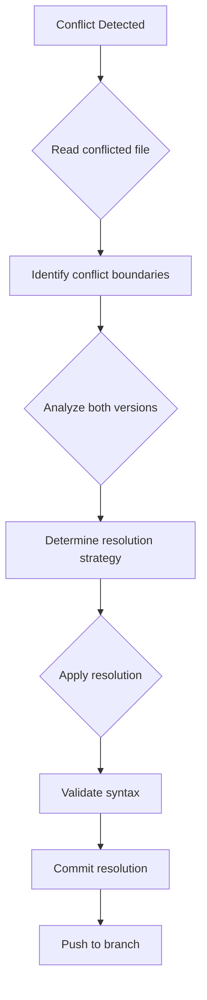
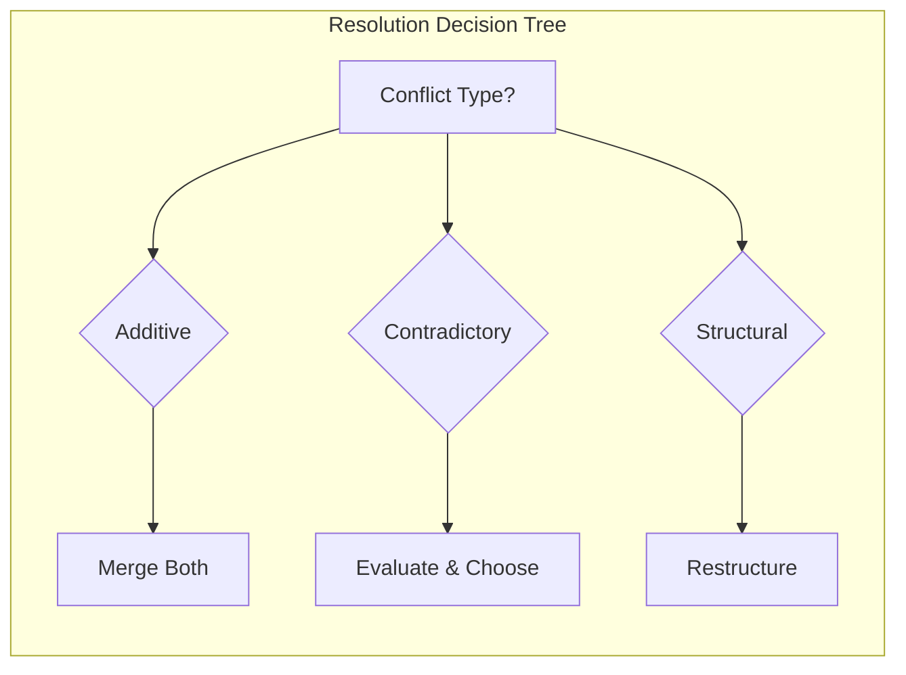
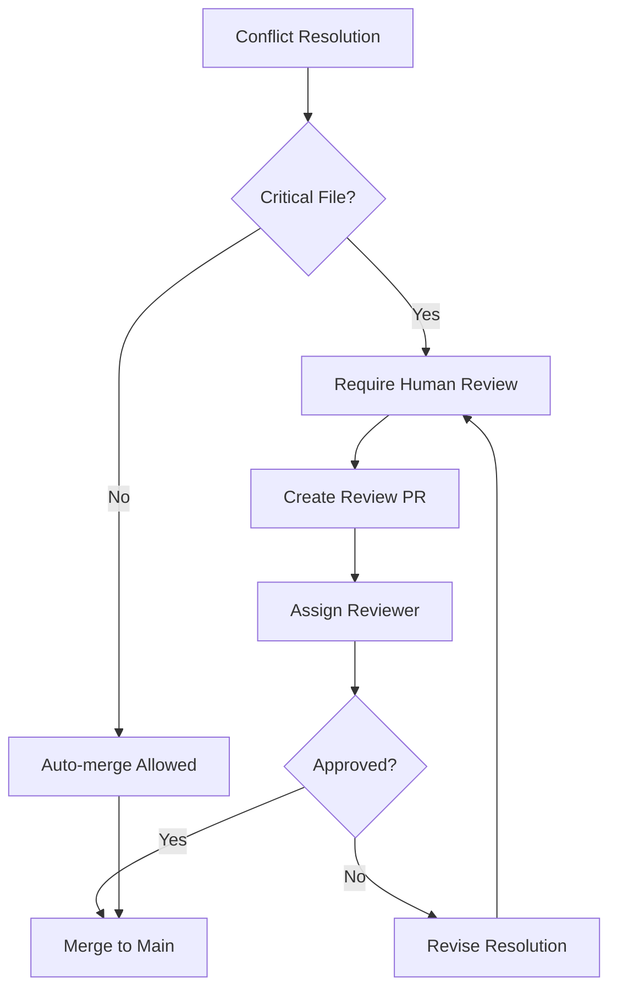
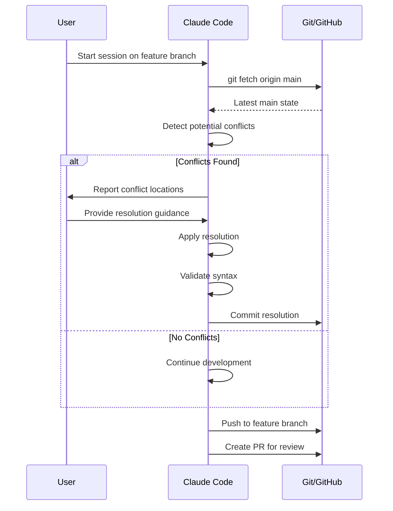

# Merge Conflict Resolution via Claude Code Web Session

## Overview

This document provides a comprehensive workflow for resolving Git merge conflicts when using Claude Code in web-based development sessions. It covers detection, analysis, resolution strategies, and governance controls to maintain code integrity.

---

## 1. Conflict Detection Patterns

### 1.1 Conflict Marker Anatomy

Git merge conflicts are marked with specific delimiters:

```
<<<<<<< HEAD (or branch name)
[Current branch changes - YOUR changes]
=======
[Incoming branch changes - THEIR changes]
>>>>>>> branch-name (or commit hash)
```

**Three-way merge conflicts** (with common ancestor):
```
<<<<<<< HEAD
[Current branch changes]
||||||| merged common ancestors
[Original content before divergence]
=======
[Incoming branch changes]
>>>>>>> feature-branch
```

### 1.2 Common Conflict Locations

| File Type | Typical Conflict Areas | Risk Level |
|-----------|----------------------|------------|
| `mkdocs.yml` | Navigation sections, plugins | Medium |
| `*.py` | Import statements, class definitions | High |
| `*.xml` | View definitions, security rules | High |
| `*.csv` | Data rows, header changes | Low |
| `*.md` | Documentation sections | Low |

### 1.3 Detection Commands

```bash
# Check for conflict state
git status

# List files with conflicts
git diff --name-only --diff-filter=U

# Show conflict markers in specific file
git diff --check

# View merge state
git ls-files -u
```

---

## 2. Claude Code Web Session Workflow

### 2.1 Pre-Resolution Checklist



### 2.2 Resolution Workflow Steps

#### Step 1: Identify Conflict State
```bash
# Check current branch and status
git status

# Expected output for conflict:
# On branch feature-branch
# You have unmerged paths.
# Unmerged paths:
#   (use "git add <file>..." to mark resolution)
#     both modified:   mkdocs.yml
```

#### Step 2: Read Conflicted File
Use Claude Code's `Read` tool to examine the full file content:
- Identify all conflict markers (`<<<<<<<`, `=======`, `>>>>>>>`)
- Note line numbers for each conflict region
- Count total number of conflicts in file

#### Step 3: Analyze Both Versions

**Questions to ask:**
1. What was the intent of each change?
2. Are the changes complementary or contradictory?
3. Which version is more complete/current?
4. Can both changes be merged logically?

#### Step 4: Apply Resolution Strategy

| Scenario | Strategy | Example |
|----------|----------|---------|
| Additive changes | Merge both | Both branches add different nav items |
| Contradictory changes | Choose one + validate | Different function implementations |
| Overlapping changes | Integrate carefully | Same section modified differently |
| Deletion vs modification | Evaluate intent | One branch deletes, other modifies |

#### Step 5: Edit and Resolve

Use Claude Code's `Edit` tool to:
1. Remove all conflict markers
2. Integrate the correct content
3. Ensure proper formatting/indentation

```python
# Example: Resolving a Python import conflict

# BEFORE (conflicted):
<<<<<<< HEAD
from odoo import models, fields, api
from odoo.exceptions import ValidationError
=======
from odoo import models, fields, api, _
from odoo.exceptions import UserError
>>>>>>> feature-branch

# AFTER (resolved - merged both):
from odoo import models, fields, api, _
from odoo.exceptions import ValidationError, UserError
```

#### Step 6: Validate and Commit
```bash
# Mark file as resolved
git add <resolved-file>

# Verify no remaining conflicts
git diff --check

# Commit the resolution
git commit -m "resolve: Merge conflict in <file> - <brief description>"

# Push to branch
git push -u origin <branch-name>
```

---

## 3. Conflict Resolution Strategies

### 3.1 Strategy Matrix



### 3.2 YAML/Config File Conflicts

**Common in:** `mkdocs.yml`, `manifest.py`, `docker-compose.yml`

**Resolution Pattern:**
```yaml
# Conflict in mkdocs.yml navigation
# OURS: Added IT Controls section
# THEIRS: Added different IT Controls path

# Resolution: Keep more complete version
nav:
  - IT Controls & Audit:
      - Audit Remediation Plan: IT-Controls/01-audit-remediation-plan.md
      - GITC Testing Playbook: IT-Controls/02-gitc-testing-playbook.md
      - SoD Matrix Artifact: IT-Controls/03-sod-matrix-artifact.md
      - Physical Security Controls: IT-Controls/04-physical-security-controls.md
      - IT Asset Management: IT-Controls/05-it-asset-management.md
      # Note: Supersedes single-file approach from main branch
```

### 3.3 Python Module Conflicts

**Common in:** `models/*.py`, `__init__.py`, `controllers/*.py`

**Resolution Pattern:**
```python
# Conflict in model field definitions

# OURS: Added computed field
# THEIRS: Added related field

# Resolution: Include both (non-conflicting additions)
class AfcCloseCalendar(models.Model):
    _name = 'afc.close.calendar'

    # From our branch
    progress_percent = fields.Float(
        compute='_compute_progress',
        store=True
    )

    # From their branch
    company_id = fields.Many2one(
        'res.company',
        related='period_id.company_id',
        store=True
    )
```

### 3.4 XML View Conflicts

**Common in:** `views/*.xml`, `security/*.xml`

**Resolution Pattern:**
```xml
<!-- Conflict in form view inheritance -->

<!-- Resolution: Merge xpath expressions carefully -->
<record id="view_afc_calendar_form" model="ir.ui.view">
    <field name="name">afc.close.calendar.form</field>
    <field name="model">afc.close.calendar</field>
    <field name="arch" type="xml">
        <form>
            <!-- From our branch: header buttons -->
            <header>
                <button name="action_activate" type="object" string="Activate"/>
            </header>
            <!-- From their branch: sheet content -->
            <sheet>
                <group>
                    <field name="name"/>
                    <field name="period_id"/>
                </group>
            </sheet>
        </form>
    </field>
</record>
```

---

## 4. Governance & Audit Controls

### 4.1 Resolution Documentation

Every merge conflict resolution must be documented:

| Field | Description | Example |
|-------|-------------|---------|
| `conflict_id` | Unique identifier | `MCR-2025-001` |
| `file_path` | Affected file | `mkdocs.yml` |
| `branches` | Source/target branches | `claude/feature → main` |
| `conflict_type` | Classification | `additive`, `contradictory` |
| `resolution_strategy` | Approach taken | `merged_both`, `chose_ours` |
| `resolver` | Who resolved | `claude-code-session` |
| `review_status` | Approval state | `pending`, `approved` |

### 4.2 Four-Eyes Principle for Critical Files



**Critical Files Requiring Review:**
- `security/*.xml` - Access control rules
- `models/*.py` - Business logic
- `data/*.xml` - Master data
- `.github/workflows/*.yml` - CI/CD pipelines
- `docker-compose*.yml` - Infrastructure

### 4.3 Conflict Resolution Log Template

```markdown
## Merge Conflict Resolution Log

**Date:** 2025-01-XX
**Session ID:** claude/audit-remediation-odoo-sFMhD
**Resolver:** Claude Code Web Session

### Conflict Details

| Attribute | Value |
|-----------|-------|
| File | `mkdocs.yml` |
| Line Range | 47-53 |
| Our Branch | `claude/audit-remediation-odoo-sFMhD` |
| Their Branch | `main` |
| Conflict Type | Structural (navigation section) |

### Our Changes
- Added 5 IT Controls documents with detailed structure
- Path: `IT-Controls/*.md`

### Their Changes
- Added single IT Audit document
- Path: `it-controls/it-audit-sod-deployment.md`

### Resolution Decision
**Strategy:** Chose ours (more comprehensive)

**Rationale:**
1. Our version contains 5 detailed documents vs 1 general document
2. Structured approach aligns with audit remediation requirements
3. Covers GITC testing, SoD matrix, physical security, asset management

### Validation
- [x] Syntax validated (YAML lint)
- [x] Build tested locally
- [x] No broken links
- [x] Navigation renders correctly

### Approval
- [ ] Peer review completed
- [ ] Merged to main
```

---

## 5. Automated Conflict Prevention

### 5.1 Branch Protection Rules

```yaml
# .github/branch-protection.yml
branches:
  main:
    protection:
      required_pull_request_reviews:
        required_approving_review_count: 1
        dismiss_stale_reviews: true
      required_status_checks:
        strict: true
        contexts:
          - "build"
          - "lint"
      restrictions:
        users: []
        teams: ["maintainers"]
```

### 5.2 Pre-commit Hooks

```yaml
# .pre-commit-config.yaml
repos:
  - repo: https://github.com/pre-commit/pre-commit-hooks
    rev: v4.5.0
    hooks:
      - id: check-merge-conflict
        name: Check for merge conflict markers
      - id: check-yaml
        name: Validate YAML syntax
      - id: end-of-file-fixer
      - id: trailing-whitespace

  - repo: https://github.com/adrienverge/yamllint
    rev: v1.33.0
    hooks:
      - id: yamllint
        args: [-c=.yamllint.yml]
```

### 5.3 CI/CD Conflict Detection

```yaml
# .github/workflows/conflict-check.yml
name: Conflict Detection

on:
  pull_request:
    branches: [main]

jobs:
  check-conflicts:
    runs-on: ubuntu-latest
    steps:
      - uses: actions/checkout@v4
        with:
          fetch-depth: 0

      - name: Check for conflict markers
        run: |
          if grep -rn "<<<<<<< \|======= \|>>>>>>> " --include="*.py" --include="*.yml" --include="*.xml" --include="*.md" .; then
            echo "::error::Merge conflict markers found in files"
            exit 1
          fi

      - name: Validate YAML files
        run: |
          pip install yamllint
          yamllint -c .yamllint.yml .

      - name: Check Python syntax
        run: |
          pip install flake8
          flake8 --select=E999 .
```

---

## 6. Claude Code Web Session Best Practices

### 6.1 Session Workflow



### 6.2 Resolution Commands Reference

| Task | Command | Notes |
|------|---------|-------|
| Fetch latest | `git fetch origin main` | Always before merge |
| Start merge | `git merge origin/main` | Triggers conflict detection |
| View conflicts | `git diff --name-only --diff-filter=U` | List affected files |
| Abort merge | `git merge --abort` | Reset to pre-merge state |
| Mark resolved | `git add <file>` | After manual resolution |
| Complete merge | `git commit` | Opens editor for message |
| Use ours | `git checkout --ours <file>` | Keep current branch version |
| Use theirs | `git checkout --theirs <file>` | Keep incoming version |

### 6.3 Error Recovery

**Scenario 1: Accidental wrong resolution**
```bash
# Reset file to conflicted state
git checkout -m <file>

# Or reset entire merge
git merge --abort
git merge origin/main
```

**Scenario 2: Pushed incorrect resolution**
```bash
# Create fix commit (preferred)
git revert HEAD
git push

# Or amend if not yet reviewed (careful!)
git commit --amend
git push --force-with-lease
```

**Scenario 3: Complex multi-file conflict**
```bash
# Resolve one file at a time
git add file1.py
git add file2.xml
# Continue until all resolved
git diff --check  # Verify no remaining markers
git commit
```

---

## 7. Integration with Odoo Development

### 7.1 Module Manifest Conflicts

```python
# __manifest__.py conflict resolution

# Common conflict: dependency lists
{
    'name': 'AFC Close Manager',
    'depends': [
        'base',
        'account',
        'hr',           # From our branch
        'project',      # From our branch
        'mail',         # From their branch
        'web',          # From their branch
    ],  # Resolution: merge all unique dependencies
}
```

### 7.2 Security XML Conflicts

```xml
<!-- Conflict in ir.model.access.csv -->
<!-- Resolution: Combine access rules, check for duplicates -->

id,name,model_id:id,group_id:id,perm_read,perm_write,perm_create,perm_unlink
access_afc_calendar_user,afc.calendar.user,model_afc_close_calendar,group_afc_user,1,1,1,0
access_afc_calendar_manager,afc.calendar.manager,model_afc_close_calendar,group_afc_manager,1,1,1,1
access_afc_task_user,afc.task.user,model_afc_close_task,group_afc_user,1,1,1,0
```

### 7.3 View Inheritance Conflicts

```xml
<!-- When multiple branches extend same view -->
<!-- Resolution: Order xpath expressions by position -->

<record id="view_account_move_form_inherit" model="ir.ui.view">
    <field name="inherit_id" ref="account.view_move_form"/>
    <field name="arch" type="xml">
        <!-- From branch A: Add field after partner_id -->
        <xpath expr="//field[@name='partner_id']" position="after">
            <field name="afc_period_id"/>
        </xpath>

        <!-- From branch B: Add field in header -->
        <xpath expr="//header" position="inside">
            <field name="afc_state" widget="statusbar"/>
        </xpath>
    </field>
</record>
```

---

## 8. Audit Trail Requirements

### 8.1 Resolution Metadata

Every resolution should capture:

```json
{
  "resolution_id": "MCR-2025-001",
  "timestamp": "2025-01-15T10:30:00Z",
  "session_type": "claude-code-web",
  "branch_context": {
    "source": "claude/audit-remediation-odoo-sFMhD",
    "target": "main",
    "base_commit": "928e36b",
    "head_commit": "d3f1869"
  },
  "conflicts": [
    {
      "file": "mkdocs.yml",
      "lines": "47-53",
      "type": "structural",
      "strategy": "chose_ours",
      "rationale": "More comprehensive IT Controls structure"
    }
  ],
  "validation": {
    "syntax_check": "passed",
    "build_test": "passed",
    "link_check": "passed"
  },
  "approval": {
    "status": "pending",
    "reviewer": null,
    "approved_at": null
  }
}
```

### 8.2 Git Commit Message Format

```
resolve(<scope>): <brief description>

Conflict Details:
- File(s): <list of files>
- Branches: <source> → <target>
- Strategy: <resolution approach>

Changes:
- <what was kept/merged/discarded>

Validation:
- [x] Syntax validated
- [x] Build passed
- [x] Tests passed

Refs: #<issue-number>
```

---

## 9. Troubleshooting Guide

### 9.1 Common Issues

| Issue | Cause | Solution |
|-------|-------|----------|
| Edit tool fails | Conflict markers in search string | Read file first, use exact content |
| Push rejected | Branch protection | Create PR instead of direct push |
| Merge abort fails | Uncommitted changes | Stash changes first |
| Conflict reappears | Incomplete resolution | Check all conflict markers removed |
| YAML parse error | Indentation issue | Validate with yamllint |

### 9.2 Recovery Procedures

**Lost work during resolution:**
```bash
# Find lost commits
git reflog

# Recover specific commit
git cherry-pick <commit-hash>
```

**Corrupted merge state:**
```bash
# Hard reset (loses uncommitted changes!)
git reset --hard HEAD

# Or reset to specific commit
git reset --hard origin/main
```

---

## 10. References

- [Git Documentation - Basic Merge Conflicts](https://git-scm.com/book/en/v2/Git-Branching-Basic-Branching-and-Merging)
- [GitHub - Resolving Merge Conflicts](https://docs.github.com/en/pull-requests/collaborating-with-pull-requests/addressing-merge-conflicts)
- [Odoo Development Guidelines](https://www.odoo.com/documentation/17.0/contributing/development.html)
- [Claude Code Documentation](https://docs.anthropic.com/claude-code)

---

*Document Version: 1.0*
*Last Updated: 2025-01-XX*
*Author: Claude Code Web Session*
*Review Status: Draft*
