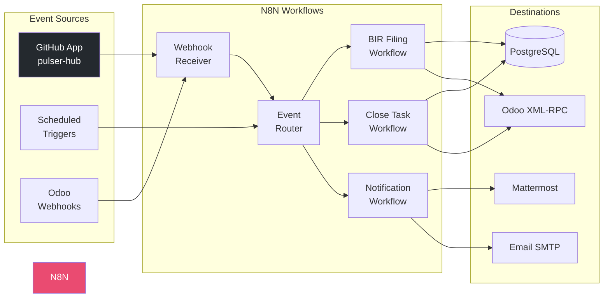

# N8N Workflow Automation

## Overview

N8N serves as the central workflow automation platform for the AFC system, handling GitHub event processing, BIR filing automation, close task orchestration, and notification routing.

## Architecture



## GitHub App Integration

### App Configuration

| Setting | Value |
|---------|-------|
| App Name | pulser-hub |
| App ID | 2191216 |
| Client ID | Iv23liwGL7fnYySPPAjS |
| Webhook URL | `https://n8n.insightpulseai.net/webhook/github/pulser-hub` |
| Webhook Secret | (configured in N8N credentials) |

### Event Subscriptions

| Event | Trigger | Action |
|-------|---------|--------|
| `issues.opened` | New issue created | Create close task if labeled `afc-task` |
| `issues.labeled` | Label added | Route to appropriate workflow |
| `pull_request.opened` | PR created | Link to close task if referenced |
| `pull_request.merged` | PR merged | Mark linked task as completed |
| `push` | Code pushed | Trigger documentation rebuild |
| `check_run.completed` | CI completed | Update task status |

### Webhook Payload Processing

```json
{
  "name": "GitHub Events to AFC Closing Tasks",
  "nodes": [
    {
      "parameters": {
        "path": "github/pulser-hub",
        "httpMethod": "POST",
        "responseMode": "responseNode",
        "options": {}
      },
      "id": "webhook-receiver",
      "name": "Webhook",
      "type": "n8n-nodes-base.webhook",
      "typeVersion": 1.1,
      "position": [250, 300]
    },
    {
      "parameters": {
        "conditions": {
          "options": {
            "caseSensitive": true,
            "leftValue": "",
            "typeValidation": "strict"
          },
          "conditions": [
            {
              "id": "condition-issues",
              "leftValue": "={{ $json.headers['x-github-event'] }}",
              "rightValue": "issues",
              "operator": {
                "type": "string",
                "operation": "equals"
              }
            },
            {
              "id": "condition-pr",
              "leftValue": "={{ $json.headers['x-github-event'] }}",
              "rightValue": "pull_request",
              "operator": {
                "type": "string",
                "operation": "equals"
              }
            }
          ],
          "combinator": "or"
        }
      },
      "id": "event-router",
      "name": "Route by Event Type",
      "type": "n8n-nodes-base.switch",
      "typeVersion": 3,
      "position": [450, 300]
    },
    {
      "parameters": {
        "operation": "executeQuery",
        "query": "INSERT INTO afc_github_event (event_type, action, payload, created_at) VALUES ($1, $2, $3, NOW()) RETURNING id",
        "options": {}
      },
      "id": "log-event",
      "name": "Log to PostgreSQL",
      "type": "n8n-nodes-base.postgres",
      "typeVersion": 2.3,
      "position": [650, 200],
      "credentials": {
        "postgres": {
          "id": "postgres-afc",
          "name": "AFC PostgreSQL"
        }
      }
    },
    {
      "parameters": {
        "method": "POST",
        "url": "={{ $env.ODOO_URL }}/xmlrpc/2/object",
        "authentication": "genericCredentialType",
        "genericAuthType": "httpBasicAuth",
        "sendBody": true,
        "bodyParameters": {
          "parameters": [
            {
              "name": "params",
              "value": "={{ JSON.stringify({ 'name': $json.body.issue.title, 'description': $json.body.issue.body, 'github_issue_id': $json.body.issue.id }) }}"
            }
          ]
        }
      },
      "id": "create-odoo-task",
      "name": "Create Odoo Close Task",
      "type": "n8n-nodes-base.httpRequest",
      "typeVersion": 4.1,
      "position": [650, 400]
    },
    {
      "parameters": {
        "channel": "#afc-notifications",
        "text": "=:github: New AFC task created from GitHub issue #{{ $json.body.issue.number }}: {{ $json.body.issue.title }}",
        "attachments": [],
        "otherOptions": {}
      },
      "id": "notify-mattermost",
      "name": "Notify Mattermost",
      "type": "n8n-nodes-base.mattermost",
      "typeVersion": 1,
      "position": [850, 300],
      "credentials": {
        "mattermostApi": {
          "id": "mattermost-afc",
          "name": "AFC Mattermost"
        }
      }
    },
    {
      "parameters": {
        "respondWith": "json",
        "responseBody": "={{ JSON.stringify({ 'status': 'processed', 'event_id': $('Log to PostgreSQL').item.json.id }) }}"
      },
      "id": "respond-webhook",
      "name": "Respond to GitHub",
      "type": "n8n-nodes-base.respondToWebhook",
      "typeVersion": 1,
      "position": [1050, 300]
    }
  ],
  "connections": {
    "Webhook": {
      "main": [
        [
          {
            "node": "Route by Event Type",
            "type": "main",
            "index": 0
          }
        ]
      ]
    },
    "Route by Event Type": {
      "main": [
        [
          {
            "node": "Log to PostgreSQL",
            "type": "main",
            "index": 0
          }
        ],
        [
          {
            "node": "Create Odoo Close Task",
            "type": "main",
            "index": 0
          }
        ]
      ]
    },
    "Log to PostgreSQL": {
      "main": [
        [
          {
            "node": "Notify Mattermost",
            "type": "main",
            "index": 0
          }
        ]
      ]
    },
    "Create Odoo Close Task": {
      "main": [
        [
          {
            "node": "Notify Mattermost",
            "type": "main",
            "index": 0
          }
        ]
      ]
    },
    "Notify Mattermost": {
      "main": [
        [
          {
            "node": "Respond to GitHub",
            "type": "main",
            "index": 0
          }
        ]
      ]
    }
  },
  "settings": {
    "executionOrder": "v1"
  }
}
```

## Core Workflows

### 1. BIR Filing Automation

Automates Philippine BIR tax form preparation and filing notifications.

```json
{
  "name": "BIR Filing Automation",
  "nodes": [
    {
      "parameters": {
        "rule": {
          "interval": [
            {
              "field": "cronExpression",
              "expression": "0 8 * * *"
            }
          ]
        }
      },
      "id": "daily-trigger",
      "name": "Daily 8AM Trigger",
      "type": "n8n-nodes-base.scheduleTrigger",
      "typeVersion": 1.1,
      "position": [250, 300]
    },
    {
      "parameters": {
        "operation": "executeQuery",
        "query": "SELECT * FROM afc_tax_calendar WHERE deadline BETWEEN CURRENT_DATE AND CURRENT_DATE + INTERVAL '7 days' AND is_filed = false ORDER BY deadline",
        "options": {}
      },
      "id": "fetch-upcoming",
      "name": "Fetch Upcoming Deadlines",
      "type": "n8n-nodes-base.postgres",
      "typeVersion": 2.3,
      "position": [450, 300]
    },
    {
      "parameters": {
        "conditions": {
          "number": [
            {
              "value1": "={{ $json.length }}",
              "operation": "larger",
              "value2": 0
            }
          ]
        }
      },
      "id": "check-deadlines",
      "name": "Has Upcoming Deadlines?",
      "type": "n8n-nodes-base.if",
      "typeVersion": 1,
      "position": [650, 300]
    },
    {
      "parameters": {
        "batchSize": 1,
        "options": {}
      },
      "id": "loop-deadlines",
      "name": "Loop Each Deadline",
      "type": "n8n-nodes-base.splitInBatches",
      "typeVersion": 3,
      "position": [850, 200]
    },
    {
      "parameters": {
        "method": "POST",
        "url": "={{ $env.ODOO_URL }}/api/bir/compute",
        "authentication": "genericCredentialType",
        "genericAuthType": "httpHeaderAuth",
        "sendBody": true,
        "bodyParameters": {
          "parameters": [
            {
              "name": "form_type",
              "value": "={{ $json.form_type }}"
            },
            {
              "name": "period_start",
              "value": "={{ $json.period_start }}"
            },
            {
              "name": "period_end",
              "value": "={{ $json.period_end }}"
            }
          ]
        }
      },
      "id": "compute-bir-form",
      "name": "Compute BIR Form",
      "type": "n8n-nodes-base.httpRequest",
      "typeVersion": 4.1,
      "position": [1050, 200]
    },
    {
      "parameters": {
        "fromEmail": "afc@insightpulseai.com",
        "toEmail": "={{ $env.FINANCE_TEAM_EMAIL }}",
        "subject": "=BIR {{ $json.form_type }} Due in {{ Math.ceil(($json.deadline - Date.now()) / (1000 * 60 * 60 * 24)) }} days",
        "emailType": "html",
        "html": "=<h2>BIR Filing Reminder</h2><p>Form <strong>{{ $json.form_type }}</strong> is due on <strong>{{ $json.deadline }}</strong>.</p><p>Amount Due: PHP {{ $json.amount_due.toLocaleString() }}</p><p><a href=\"{{ $env.ODOO_URL }}/web#model=afc.bir.form&id={{ $json.form_id }}\">View in Odoo</a></p>"
      },
      "id": "send-reminder",
      "name": "Send Email Reminder",
      "type": "n8n-nodes-base.emailSend",
      "typeVersion": 2.1,
      "position": [1250, 200]
    },
    {
      "parameters": {
        "channel": "#bir-filings",
        "text": "=:calendar: *BIR {{ $json.form_type }}* due in {{ Math.ceil(($json.deadline - Date.now()) / (1000 * 60 * 60 * 24)) }} days\nAmount: PHP {{ $json.amount_due.toLocaleString() }}\nStatus: {{ $json.state }}"
      },
      "id": "notify-slack",
      "name": "Notify Mattermost",
      "type": "n8n-nodes-base.mattermost",
      "typeVersion": 1,
      "position": [1250, 400]
    }
  ],
  "connections": {
    "Daily 8AM Trigger": {
      "main": [[{"node": "Fetch Upcoming Deadlines", "type": "main", "index": 0}]]
    },
    "Fetch Upcoming Deadlines": {
      "main": [[{"node": "Has Upcoming Deadlines?", "type": "main", "index": 0}]]
    },
    "Has Upcoming Deadlines?": {
      "main": [
        [{"node": "Loop Each Deadline", "type": "main", "index": 0}],
        []
      ]
    },
    "Loop Each Deadline": {
      "main": [
        [{"node": "Compute BIR Form", "type": "main", "index": 0}],
        []
      ]
    },
    "Compute BIR Form": {
      "main": [
        [
          {"node": "Send Email Reminder", "type": "main", "index": 0},
          {"node": "Notify Mattermost", "type": "main", "index": 0}
        ]
      ]
    }
  }
}
```

### 2. Month-End Close Orchestration

Manages the month-end close process with automated task creation and status tracking.

```json
{
  "name": "Month-End Close Orchestration",
  "nodes": [
    {
      "parameters": {
        "rule": {
          "interval": [
            {
              "field": "cronExpression",
              "expression": "0 6 1 * *"
            }
          ]
        }
      },
      "id": "monthly-trigger",
      "name": "1st of Month 6AM",
      "type": "n8n-nodes-base.scheduleTrigger",
      "typeVersion": 1.1,
      "position": [250, 300]
    },
    {
      "parameters": {
        "method": "POST",
        "url": "={{ $env.ODOO_URL }}/api/close/create-period",
        "sendBody": true,
        "bodyParameters": {
          "parameters": [
            {
              "name": "period_type",
              "value": "month"
            },
            {
              "name": "start_date",
              "value": "={{ new Date(new Date().getFullYear(), new Date().getMonth() - 1, 1).toISOString().split('T')[0] }}"
            },
            {
              "name": "end_date",
              "value": "={{ new Date(new Date().getFullYear(), new Date().getMonth(), 0).toISOString().split('T')[0] }}"
            }
          ]
        }
      },
      "id": "create-period",
      "name": "Create Close Period",
      "type": "n8n-nodes-base.httpRequest",
      "typeVersion": 4.1,
      "position": [450, 300]
    },
    {
      "parameters": {
        "operation": "executeQuery",
        "query": "SELECT * FROM afc_close_template WHERE is_active = true ORDER BY sequence",
        "options": {}
      },
      "id": "fetch-templates",
      "name": "Fetch Task Templates",
      "type": "n8n-nodes-base.postgres",
      "typeVersion": 2.3,
      "position": [650, 300]
    },
    {
      "parameters": {
        "batchSize": 1,
        "options": {}
      },
      "id": "loop-templates",
      "name": "Loop Each Template",
      "type": "n8n-nodes-base.splitInBatches",
      "typeVersion": 3,
      "position": [850, 300]
    },
    {
      "parameters": {
        "method": "POST",
        "url": "={{ $env.ODOO_URL }}/api/close/create-task",
        "sendBody": true,
        "bodyParameters": {
          "parameters": [
            {
              "name": "period_id",
              "value": "={{ $('Create Close Period').item.json.period_id }}"
            },
            {
              "name": "template_id",
              "value": "={{ $json.id }}"
            }
          ]
        }
      },
      "id": "create-task",
      "name": "Create Close Task",
      "type": "n8n-nodes-base.httpRequest",
      "typeVersion": 4.1,
      "position": [1050, 300]
    },
    {
      "parameters": {
        "channel": "#finance-close",
        "text": "=:rocket: *Month-End Close Initiated*\n\nPeriod: {{ $('Create Close Period').item.json.name }}\nTasks Created: {{ $('Fetch Task Templates').item.json.length }}\nDue Date: {{ $('Create Close Period').item.json.close_date }}\n\n<{{ $env.ODOO_URL }}/web#model=afc.close.period&id={{ $('Create Close Period').item.json.period_id }}|View Close Period>"
      },
      "id": "notify-team",
      "name": "Notify Finance Team",
      "type": "n8n-nodes-base.mattermost",
      "typeVersion": 1,
      "position": [1250, 300]
    }
  ]
}
```

### 3. SoD Violation Alert

Real-time alerting when separation of duties violations are detected.

```json
{
  "name": "SoD Violation Alerts",
  "nodes": [
    {
      "parameters": {
        "path": "sod/violation",
        "httpMethod": "POST",
        "responseMode": "responseNode"
      },
      "id": "violation-webhook",
      "name": "Violation Webhook",
      "type": "n8n-nodes-base.webhook",
      "typeVersion": 1.1,
      "position": [250, 300]
    },
    {
      "parameters": {
        "conditions": {
          "string": [
            {
              "value1": "={{ $json.severity }}",
              "operation": "equals",
              "value2": "critical"
            }
          ]
        }
      },
      "id": "check-severity",
      "name": "Is Critical?",
      "type": "n8n-nodes-base.if",
      "typeVersion": 1,
      "position": [450, 300]
    },
    {
      "parameters": {
        "fromEmail": "sod-alerts@insightpulseai.com",
        "toEmail": "={{ $env.AUDIT_TEAM_EMAIL }}",
        "subject": "=CRITICAL: SoD Violation - {{ $json.rule_code }}",
        "emailType": "html",
        "html": "=<h2 style=\"color: red;\">Critical SoD Violation Detected</h2><table><tr><td>Rule:</td><td>{{ $json.rule_code }} - {{ $json.rule_name }}</td></tr><tr><td>User:</td><td>{{ $json.user_name }}</td></tr><tr><td>Action:</td><td>{{ $json.action_performed }}</td></tr><tr><td>Conflicting Action:</td><td>{{ $json.conflicting_action }}</td></tr><tr><td>Was Blocked:</td><td>{{ $json.was_blocked ? 'Yes' : 'No' }}</td></tr><tr><td>Timestamp:</td><td>{{ $json.violation_date }}</td></tr></table><p><a href=\"{{ $env.ODOO_URL }}/web#model=afc.sod.violation&id={{ $json.violation_id }}\">View Violation Details</a></p>"
      },
      "id": "email-critical",
      "name": "Email Audit Team",
      "type": "n8n-nodes-base.emailSend",
      "typeVersion": 2.1,
      "position": [650, 200]
    },
    {
      "parameters": {
        "channel": "#sod-violations",
        "text": "=:warning: *SoD Violation Detected*\n\nSeverity: {{ $json.severity }}\nRule: {{ $json.rule_code }}\nUser: {{ $json.user_name }}\nBlocked: {{ $json.was_blocked ? 'Yes' : 'No' }}"
      },
      "id": "notify-channel",
      "name": "Notify SoD Channel",
      "type": "n8n-nodes-base.mattermost",
      "typeVersion": 1,
      "position": [650, 400]
    },
    {
      "parameters": {
        "operation": "executeQuery",
        "query": "UPDATE afc_sod_violation SET notification_sent = true, notification_date = NOW() WHERE id = $1",
        "options": {}
      },
      "id": "update-status",
      "name": "Mark Notified",
      "type": "n8n-nodes-base.postgres",
      "typeVersion": 2.3,
      "position": [850, 300]
    }
  ]
}
```

### 4. Close Task Status Sync

Synchronizes task status between GitHub issues and Odoo close tasks.

```json
{
  "name": "Close Task Status Sync",
  "nodes": [
    {
      "parameters": {
        "rule": {
          "interval": [
            {
              "field": "minutes",
              "minutesInterval": 15
            }
          ]
        }
      },
      "id": "sync-trigger",
      "name": "Every 15 Minutes",
      "type": "n8n-nodes-base.scheduleTrigger",
      "typeVersion": 1.1,
      "position": [250, 300]
    },
    {
      "parameters": {
        "operation": "executeQuery",
        "query": "SELECT t.id, t.state, t.github_issue_id, t.github_issue_number FROM afc_close_task t WHERE t.github_issue_id IS NOT NULL AND t.state IN ('completed', 'approved') AND t.github_synced = false",
        "options": {}
      },
      "id": "fetch-unsynced",
      "name": "Fetch Unsynced Tasks",
      "type": "n8n-nodes-base.postgres",
      "typeVersion": 2.3,
      "position": [450, 300]
    },
    {
      "parameters": {
        "batchSize": 1
      },
      "id": "loop-tasks",
      "name": "Loop Tasks",
      "type": "n8n-nodes-base.splitInBatches",
      "typeVersion": 3,
      "position": [650, 300]
    },
    {
      "parameters": {
        "method": "PATCH",
        "url": "=https://api.github.com/repos/{{ $env.GITHUB_OWNER }}/{{ $env.GITHUB_REPO }}/issues/{{ $json.github_issue_number }}",
        "authentication": "genericCredentialType",
        "genericAuthType": "httpHeaderAuth",
        "sendBody": true,
        "bodyParameters": {
          "parameters": [
            {
              "name": "state",
              "value": "closed"
            },
            {
              "name": "labels",
              "value": "={{ JSON.stringify(['afc-completed']) }}"
            }
          ]
        }
      },
      "id": "close-github-issue",
      "name": "Close GitHub Issue",
      "type": "n8n-nodes-base.httpRequest",
      "typeVersion": 4.1,
      "position": [850, 300]
    },
    {
      "parameters": {
        "operation": "executeQuery",
        "query": "UPDATE afc_close_task SET github_synced = true, github_synced_date = NOW() WHERE id = $1",
        "options": {}
      },
      "id": "mark-synced",
      "name": "Mark Synced",
      "type": "n8n-nodes-base.postgres",
      "typeVersion": 2.3,
      "position": [1050, 300]
    }
  ]
}
```

## Workflow Credentials

### Required Credentials

| Credential | Type | Usage |
|------------|------|-------|
| `postgres-afc` | PostgreSQL | Database operations |
| `mattermost-afc` | Mattermost API | Notifications |
| `github-app` | GitHub App | Issue/PR management |
| `odoo-api` | HTTP Header Auth | Odoo XML-RPC calls |
| `smtp-afc` | SMTP | Email notifications |

### Environment Variables

```bash
# N8N Environment
N8N_HOST=n8n.insightpulseai.net
N8N_PROTOCOL=https
WEBHOOK_URL=https://n8n.insightpulseai.net/

# Odoo Connection
ODOO_URL=https://odoo.insightpulseai.net
ODOO_DB=odoo
ODOO_API_KEY=your-api-key

# GitHub App
GITHUB_APP_ID=2191216
GITHUB_OWNER=jgtolentino
GITHUB_REPO=odoo-ce-close-mono

# Notifications
FINANCE_TEAM_EMAIL=finance@insightpulseai.com
AUDIT_TEAM_EMAIL=audit@insightpulseai.com

# Timezone
GENERIC_TIMEZONE=Asia/Manila
```

## Webhook Endpoints

| Endpoint | Method | Purpose |
|----------|--------|---------|
| `/webhook/github/pulser-hub` | POST | GitHub App events |
| `/webhook/odoo/task-update` | POST | Odoo task state changes |
| `/webhook/sod/violation` | POST | SoD violation alerts |
| `/webhook/bir/computed` | POST | BIR form computation complete |

## CLI Commands

The AFC system provides 75+ CLI commands for workflow management:

```bash
# Workflow Management
n8n workflow:list
n8n workflow:execute --id <workflow-id>
n8n workflow:activate --id <workflow-id>
n8n workflow:deactivate --id <workflow-id>

# Execution History
n8n execution:list --workflow <workflow-id>
n8n execution:get --id <execution-id>
n8n execution:delete --id <execution-id>

# Credential Management
n8n credential:list
n8n credential:create --type <type> --name <name>

# Import/Export
n8n export:workflow --id <workflow-id> --output workflow.json
n8n import:workflow --input workflow.json
n8n export:credentials --output credentials.json
n8n import:credentials --input credentials.json
```

## Monitoring

### Execution Metrics

| Metric | Target | Alert Threshold |
|--------|--------|-----------------|
| Workflow Success Rate | > 99% | < 95% |
| Average Execution Time | < 30s | > 60s |
| Failed Executions/Hour | < 5 | > 10 |
| Webhook Response Time | < 500ms | > 2000ms |

### Prometheus Metrics

```yaml
# N8N metrics endpoint
- job_name: 'n8n'
  static_configs:
    - targets: ['n8n:5678']
  metrics_path: /metrics
```

### Alerting Rules

```yaml
groups:
  - name: n8n-alerts
    rules:
      - alert: N8NWorkflowFailureRate
        expr: rate(n8n_workflow_executions_failed_total[5m]) > 0.1
        for: 5m
        labels:
          severity: warning
        annotations:
          summary: "N8N workflow failure rate high"

      - alert: N8NWebhookLatency
        expr: histogram_quantile(0.95, n8n_webhook_response_time_seconds_bucket) > 2
        for: 5m
        labels:
          severity: warning
        annotations:
          summary: "N8N webhook latency exceeds threshold"
```
