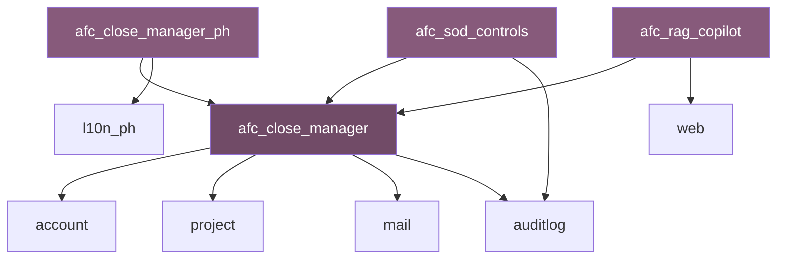

# AFC Module Architecture

## Overview

The Advanced Financial Close (AFC) solution consists of four custom Odoo CE 18 modules that together provide enterprise-grade financial close management with Philippine tax compliance, separation of duties controls, and AI-assisted documentation.

## Module Structure

```
odoo-ce-close-mono/
├── addons/
│   ├── afc_close_manager/          # Core close orchestration
│   │   ├── __init__.py
│   │   ├── __manifest__.py
│   │   ├── models/
│   │   │   ├── __init__.py
│   │   │   ├── close_period.py      # ~400 LOC
│   │   │   ├── close_task.py        # ~600 LOC
│   │   │   ├── close_template.py    # ~350 LOC
│   │   │   └── close_checklist.py   # ~300 LOC
│   │   ├── views/
│   │   │   ├── close_period_views.xml
│   │   │   ├── close_task_views.xml
│   │   │   ├── close_template_views.xml
│   │   │   └── menu.xml
│   │   ├── security/
│   │   │   ├── ir.model.access.csv
│   │   │   └── security.xml
│   │   ├── data/
│   │   │   ├── close_sequence.xml
│   │   │   └── mail_template.xml
│   │   └── wizard/
│   │       └── create_period_wizard.py
│   │
│   ├── afc_close_manager_ph/       # Philippine localization
│   │   ├── __init__.py
│   │   ├── __manifest__.py
│   │   ├── models/
│   │   │   ├── __init__.py
│   │   │   ├── bir_form.py          # ~500 LOC
│   │   │   ├── bir_schedule.py      # ~400 LOC
│   │   │   ├── wht_rate.py          # ~250 LOC
│   │   │   └── tax_calendar.py      # ~300 LOC
│   │   ├── views/
│   │   │   ├── bir_form_views.xml
│   │   │   ├── bir_schedule_views.xml
│   │   │   └── menu.xml
│   │   ├── security/
│   │   │   └── ir.model.access.csv
│   │   ├── data/
│   │   │   ├── bir_forms_data.xml   # 1601-C, 2550Q, 1702-RT
│   │   │   ├── wht_rates_data.xml   # RR 2-98 rates
│   │   │   └── tax_calendar_2025.xml
│   │   └── report/
│   │       ├── bir_1601c_template.xml
│   │       ├── bir_2550q_template.xml
│   │       └── bir_1702rt_template.xml
│   │
│   ├── afc_sod_controls/           # Separation of duties
│   │   ├── __init__.py
│   │   ├── __manifest__.py
│   │   ├── models/
│   │   │   ├── __init__.py
│   │   │   ├── sod_rule.py          # ~450 LOC
│   │   │   ├── sod_violation.py     # ~350 LOC
│   │   │   ├── role_assignment.py   # ~300 LOC
│   │   │   └── audit_trail.py       # ~400 LOC
│   │   ├── views/
│   │   │   ├── sod_rule_views.xml
│   │   │   ├── sod_violation_views.xml
│   │   │   └── menu.xml
│   │   ├── security/
│   │   │   ├── ir.model.access.csv
│   │   │   └── sod_groups.xml
│   │   └── data/
│   │       └── sod_rules_data.xml   # SAP GRC-style rules
│   │
│   └── afc_rag_copilot/            # AI documentation assistant
│       ├── __init__.py
│       ├── __manifest__.py
│       ├── models/
│       │   ├── __init__.py
│       │   ├── document_chunk.py    # ~350 LOC
│       │   ├── embedding.py         # ~400 LOC
│       │   ├── query_log.py         # ~250 LOC
│       │   └── copilot_config.py    # ~200 LOC
│       ├── controllers/
│       │   └── copilot_api.py       # ~300 LOC
│       ├── views/
│       │   ├── copilot_views.xml
│       │   └── menu.xml
│       ├── security/
│       │   └── ir.model.access.csv
│       └── static/
│           └── src/
│               └── js/
│                   └── copilot_widget.js
│
├── docker/
│   ├── Dockerfile
│   ├── docker-compose.yml
│   ├── docker-compose.prod.yml
│   └── nginx/
│       └── default.conf
│
├── scripts/
│   ├── init_db.sh
│   ├── backup.sh
│   └── deploy.sh
│
├── tests/
│   ├── conftest.py
│   ├── test_close_manager/
│   ├── test_close_manager_ph/
│   ├── test_sod_controls/
│   └── test_rag_copilot/
│
└── docs/
    ├── architecture.md
    ├── deployment.md
    └── api-reference.md
```

## Module Specifications

### 1. afc_close_manager (Core Close Orchestration)

**Purpose**: Provides SAP AFC-equivalent close period management, task orchestration, and template-driven workflows.

**Key Models**:

| Model | Description | Key Fields |
|-------|-------------|------------|
| `afc.close.period` | Represents a fiscal close period (month/quarter/year) | `name`, `period_type`, `fiscal_year_id`, `state`, `start_date`, `end_date`, `company_id` |
| `afc.close.task` | Individual close task with ownership and deadlines | `name`, `period_id`, `template_id`, `assigned_user_id`, `state`, `due_date`, `completion_date` |
| `afc.close.template` | Reusable task template for recurring close activities | `name`, `task_type`, `default_duration`, `required_evidence`, `sod_rule_ids` |
| `afc.close.checklist` | Checklist items within a task | `task_id`, `description`, `is_completed`, `completed_by`, `completed_date` |

**States Flow**:
```
draft → open → in_progress → review → approved → closed
                    ↓
                rejected → in_progress
```

**Key Features**:
- Hierarchical task dependencies (parent/child relationships)
- Automatic deadline calculation based on close date
- Evidence attachment requirements per task type
- Bulk task creation from templates
- Period lock with audit trail

**Manifest**:
```python
{
    'name': 'AFC Close Manager',
    'version': '18.0.1.0.0',
    'category': 'Accounting/Financial Close',
    'summary': 'SAP AFC-equivalent close period and task management',
    'author': 'InsightPulse AI',
    'website': 'https://insightpulseai.com',
    'license': 'LGPL-3',
    'depends': ['account', 'project', 'mail', 'auditlog'],
    'data': [
        'security/security.xml',
        'security/ir.model.access.csv',
        'data/close_sequence.xml',
        'data/mail_template.xml',
        'views/close_period_views.xml',
        'views/close_task_views.xml',
        'views/close_template_views.xml',
        'views/menu.xml',
        'wizard/create_period_wizard.xml',
    ],
    'installable': True,
    'application': True,
    'auto_install': False,
}
```

---

### 2. afc_close_manager_ph (Philippine Localization)

**Purpose**: Extends core AFC with Philippine BIR tax compliance, form generation, and filing calendar management.

**Key Models**:

| Model | Description | Key Fields |
|-------|-------------|------------|
| `afc.bir.form` | BIR tax form instance | `form_type`, `period_id`, `filing_date`, `amount_due`, `state`, `confirmation_number` |
| `afc.bir.schedule` | BIR form line items and schedules | `form_id`, `schedule_type`, `line_items`, `subtotal` |
| `afc.wht.rate` | Withholding tax rate configuration | `income_type`, `rate`, `threshold`, `effective_date` |
| `afc.tax.calendar` | Filing deadline calendar | `form_type`, `period`, `deadline`, `reminder_days` |

**Supported BIR Forms**:

| Form | Description | Frequency |
|------|-------------|-----------|
| 1601-C | Monthly Remittance Return - Creditable WHT | Monthly |
| 1601-E | Monthly Remittance Return - Expanded WHT | Monthly |
| 0619-E | Monthly Remittance - Expanded WHT | Monthly |
| 2550Q | Quarterly VAT Return | Quarterly |
| 1702-RT | Annual Income Tax Return (Regular) | Annual |
| 1604-E | Annual Information Return (Expanded WHT) | Annual |
| 1604-F | Annual Information Return (Final WHT) | Annual |
| 1700 | Annual Income Tax Return (Individual) | Annual |

**WHT Rate Configuration (RR 2-98)**:

| Income Type | Rate | Threshold |
|-------------|------|-----------|
| Professional Fees (Individual) | 10% | P720,000/year |
| Professional Fees (Corporate) | 15% | - |
| Rental Income | 5% | - |
| Services | 2% | - |
| Interest Income | 20% | - |
| Dividends | 10% | - |

**Manifest**:
```python
{
    'name': 'AFC Close Manager - Philippines',
    'version': '18.0.1.0.0',
    'category': 'Accounting/Localization',
    'summary': 'Philippine BIR compliance for AFC Close Manager',
    'author': 'InsightPulse AI',
    'website': 'https://insightpulseai.com',
    'license': 'LGPL-3',
    'depends': ['afc_close_manager', 'l10n_ph'],
    'data': [
        'security/ir.model.access.csv',
        'data/bir_forms_data.xml',
        'data/wht_rates_data.xml',
        'data/tax_calendar_2025.xml',
        'views/bir_form_views.xml',
        'views/bir_schedule_views.xml',
        'views/menu.xml',
        'report/bir_1601c_template.xml',
        'report/bir_2550q_template.xml',
        'report/bir_1702rt_template.xml',
    ],
    'installable': True,
    'auto_install': False,
}
```

---

### 3. afc_sod_controls (Separation of Duties)

**Purpose**: Implements SAP GRC-style separation of duties controls, conflict detection, and audit trail enforcement.

**Key Models**:

| Model | Description | Key Fields |
|-------|-------------|------------|
| `afc.sod.rule` | SoD rule definition | `name`, `rule_type`, `conflict_actions`, `severity`, `is_active` |
| `afc.sod.violation` | Detected SoD violation | `rule_id`, `user_id`, `action`, `violation_date`, `resolution_status` |
| `afc.role.assignment` | User role mappings | `user_id`, `role_id`, `company_id`, `effective_date`, `expiry_date` |
| `afc.audit.trail` | Immutable audit log | `model`, `record_id`, `action`, `user_id`, `timestamp`, `old_values`, `new_values` |

**SoD Rule Types**:

| Rule Type | Description | Example |
|-----------|-------------|---------|
| `same_user` | Same user cannot perform both actions | Preparer ≠ Approver |
| `same_role` | Same role cannot perform both actions | AP Clerk ≠ AP Supervisor |
| `segregated` | Actions must be segregated across teams | Treasury ≠ Accounting |
| `four_eyes` | Requires 4+ distinct users | Create → Review → Approve → Post |

**Pre-configured SoD Rules (SAP GRC-style)**:

| Rule ID | Description | Severity |
|---------|-------------|----------|
| SOD-001 | Vendor Master ↔ Invoice Entry | High |
| SOD-002 | Invoice Entry ↔ Payment Approval | Critical |
| SOD-003 | Journal Entry ↔ Journal Approval | High |
| SOD-004 | Bank Reconciliation ↔ Payment Processing | Critical |
| SOD-005 | User Administration ↔ Financial Transactions | Critical |
| SOD-006 | Asset Creation ↔ Asset Disposal | Medium |
| SOD-007 | Expense Entry ↔ Expense Approval | High |
| SOD-008 | Close Task Assignment ↔ Close Task Approval | High |

**Four-Eyes Principle Enforcement**:
```
Task Creation (User A)
    ↓
Task Execution (User A)
    ↓
Task Review (User B) → User B ≠ User A
    ↓
Task Approval (User C) → User C ≠ User A, User C ≠ User B
    ↓
Period Close (User D) → User D ≠ User A, B, or C
```

**Manifest**:
```python
{
    'name': 'AFC SoD Controls',
    'version': '18.0.1.0.0',
    'category': 'Accounting/Compliance',
    'summary': 'SAP GRC-style separation of duties for AFC',
    'author': 'InsightPulse AI',
    'website': 'https://insightpulseai.com',
    'license': 'LGPL-3',
    'depends': ['afc_close_manager', 'auditlog'],
    'data': [
        'security/sod_groups.xml',
        'security/ir.model.access.csv',
        'data/sod_rules_data.xml',
        'views/sod_rule_views.xml',
        'views/sod_violation_views.xml',
        'views/menu.xml',
    ],
    'installable': True,
    'auto_install': False,
}
```

---

### 4. afc_rag_copilot (AI Documentation Assistant)

**Purpose**: Provides RAG-based AI assistant for financial close documentation, policy queries, and procedure guidance.

**Key Models**:

| Model | Description | Key Fields |
|-------|-------------|------------|
| `afc.document.chunk` | Indexed document chunks for retrieval | `document_id`, `content`, `chunk_index`, `metadata` |
| `afc.embedding` | Vector embeddings for semantic search | `chunk_id`, `embedding_vector`, `model_version` |
| `afc.query.log` | Query audit trail | `user_id`, `query_text`, `response`, `sources`, `timestamp` |
| `afc.copilot.config` | Copilot configuration | `api_key`, `model`, `temperature`, `max_tokens` |

**Architecture**:
```
┌─────────────────┐     ┌──────────────────┐     ┌─────────────────┐
│   Odoo Widget   │────▶│   Copilot API    │────▶│  Claude API     │
│  (JavaScript)   │◀────│  (Controller)    │◀────│  (Anthropic)    │
└─────────────────┘     └──────────────────┘     └─────────────────┘
                               │
                               ▼
                        ┌──────────────────┐
                        │   PostgreSQL +   │
                        │   pgvector       │
                        └──────────────────┘
```

**Indexed Document Sources**:
- Close procedure manuals (SOPs)
- BIR tax filing guides
- SoD policy documents
- Audit trail requirements
- Historical close task notes

**API Endpoints**:

| Endpoint | Method | Description |
|----------|--------|-------------|
| `/api/copilot/query` | POST | Submit query, returns AI response with sources |
| `/api/copilot/feedback` | POST | Submit response feedback (thumbs up/down) |
| `/api/copilot/history` | GET | Retrieve query history for current user |
| `/api/copilot/reindex` | POST | Trigger document reindexing (admin only) |

**Manifest**:
```python
{
    'name': 'AFC RAG Copilot',
    'version': '18.0.1.0.0',
    'category': 'Productivity/AI',
    'summary': 'RAG-based AI assistant for financial close documentation',
    'author': 'InsightPulse AI',
    'website': 'https://insightpulseai.com',
    'license': 'LGPL-3',
    'depends': ['afc_close_manager', 'web'],
    'external_dependencies': {
        'python': ['anthropic', 'numpy', 'pgvector'],
    },
    'data': [
        'security/ir.model.access.csv',
        'views/copilot_views.xml',
        'views/menu.xml',
    ],
    'assets': {
        'web.assets_backend': [
            'afc_rag_copilot/static/src/js/copilot_widget.js',
        ],
    },
    'installable': True,
    'auto_install': False,
}
```

---

## Module Dependencies



## Installation Order

1. Install OCA dependencies:
   ```bash
   pip install odoo-addon-auditlog odoo-addon-project-task-dependency
   ```

2. Install base module:
   ```bash
   odoo-bin -i afc_close_manager
   ```

3. Install extensions (any order):
   ```bash
   odoo-bin -i afc_close_manager_ph,afc_sod_controls,afc_rag_copilot
   ```

## Configuration

### Environment Variables

| Variable | Description | Default |
|----------|-------------|---------|
| `AFC_SOD_STRICT_MODE` | Enable strict SoD violation blocking | `true` |
| `AFC_AUDIT_RETENTION_DAYS` | Audit log retention period | `2555` (7 years) |
| `AFC_COPILOT_API_KEY` | Claude API key for RAG copilot | - |
| `AFC_COPILOT_MODEL` | Claude model version | `claude-sonnet-4-20250514` |
| `AFC_BIR_REMINDER_DAYS` | Days before deadline for reminders | `7,3,1` |

### Database Requirements

- PostgreSQL 15+ with pgvector extension
- Minimum 10GB storage for audit trail (7-year retention)
- Connection pooling recommended (PgBouncer or Supabase pooler)

---

## Code Metrics

| Module | Python LOC | XML LOC | JS LOC | Total |
|--------|------------|---------|--------|-------|
| afc_close_manager | ~1,650 | ~800 | - | ~2,450 |
| afc_close_manager_ph | ~1,450 | ~600 | - | ~2,050 |
| afc_sod_controls | ~1,500 | ~400 | - | ~1,900 |
| afc_rag_copilot | ~1,200 | ~200 | ~400 | ~1,800 |
| **Total** | **~5,800** | **~2,000** | **~400** | **~8,200** |

## Security Considerations

### Access Control

All modules implement Odoo's standard RBAC with these additional groups:

| Group | Description | Modules |
|-------|-------------|---------|
| `afc.group_close_user` | Execute close tasks | afc_close_manager |
| `afc.group_close_reviewer` | Review and validate tasks | afc_close_manager |
| `afc.group_close_admin` | Full close administration | All |
| `afc.group_bir_user` | Generate BIR forms | afc_close_manager_ph |
| `afc.group_bir_admin` | Configure tax rates, file BIR | afc_close_manager_ph |
| `afc.group_sod_auditor` | View SoD violations | afc_sod_controls |
| `afc.group_sod_admin` | Configure SoD rules | afc_sod_controls |
| `afc.group_copilot_user` | Query copilot | afc_rag_copilot |
| `afc.group_copilot_admin` | Configure, reindex copilot | afc_rag_copilot |

### Audit Compliance

- **SOX 404**: Immutable audit trail with 7-year retention
- **Four-Eyes Principle**: Enforced via afc_sod_controls
- **Data Integrity**: All financial close operations logged with user, timestamp, and change details
