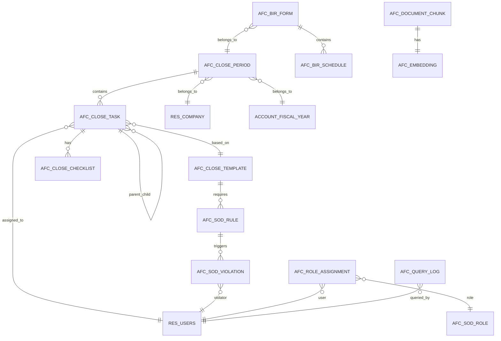

# Database Schema (DBML)

## Overview

This document defines the complete database schema for the AFC Odoo modules using DBML (Database Markup Language) notation. The schema covers 22 primary tables across four modules with full relationship mapping.

## Entity Relationship Diagram



## DBML Schema Definition

```dbml
// =============================================================================
// AFC CLOSE MANAGER - Core Tables
// =============================================================================

Table afc_close_period {
  id integer [pk, increment]
  name varchar(100) [not null]
  code varchar(20) [not null, unique]
  period_type varchar(20) [not null, note: 'month, quarter, year']
  fiscal_year_id integer [ref: > account_fiscal_year.id]
  company_id integer [ref: > res_company.id, not null]
  start_date date [not null]
  end_date date [not null]
  close_date date
  state varchar(20) [not null, default: 'draft', note: 'draft, open, in_progress, review, approved, closed']
  locked boolean [default: false]
  locked_by integer [ref: > res_users.id]
  locked_date datetime
  task_count integer [default: 0]
  completed_task_count integer [default: 0]
  create_uid integer [ref: > res_users.id]
  create_date datetime [default: `now()`]
  write_uid integer [ref: > res_users.id]
  write_date datetime

  indexes {
    (company_id, fiscal_year_id, period_type) [unique]
    state
    close_date
  }
}

Table afc_close_task {
  id integer [pk, increment]
  name varchar(200) [not null]
  code varchar(30) [not null]
  description text
  period_id integer [ref: > afc_close_period.id, not null]
  template_id integer [ref: > afc_close_template.id]
  parent_id integer [ref: > afc_close_task.id]
  sequence integer [default: 10]
  task_type varchar(30) [not null, note: 'reconciliation, review, approval, posting, reporting']
  assigned_user_id integer [ref: > res_users.id]
  reviewer_user_id integer [ref: > res_users.id]
  approver_user_id integer [ref: > res_users.id]
  state varchar(20) [not null, default: 'pending', note: 'pending, in_progress, review, approved, rejected, completed']
  priority varchar(10) [default: 'normal', note: 'low, normal, high, urgent']
  due_date datetime [not null]
  start_date datetime
  completion_date datetime
  actual_hours float [default: 0]
  estimated_hours float [default: 0]
  evidence_required boolean [default: false]
  evidence_attached boolean [default: false]
  notes text
  rejection_reason text
  create_uid integer [ref: > res_users.id]
  create_date datetime [default: `now()`]
  write_uid integer [ref: > res_users.id]
  write_date datetime

  indexes {
    period_id
    state
    assigned_user_id
    due_date
    (period_id, code) [unique]
  }
}

Table afc_close_template {
  id integer [pk, increment]
  name varchar(200) [not null]
  code varchar(30) [not null, unique]
  description text
  task_type varchar(30) [not null]
  default_duration_hours float [default: 8]
  sequence integer [default: 10]
  is_active boolean [default: true]
  requires_evidence boolean [default: false]
  evidence_types text [note: 'JSON array of allowed evidence types']
  instructions text
  company_id integer [ref: > res_company.id]
  create_uid integer [ref: > res_users.id]
  create_date datetime [default: `now()`]
  write_uid integer [ref: > res_users.id]
  write_date datetime

  indexes {
    is_active
    task_type
  }
}

Table afc_close_checklist {
  id integer [pk, increment]
  task_id integer [ref: > afc_close_task.id, not null]
  description varchar(500) [not null]
  sequence integer [default: 10]
  is_completed boolean [default: false]
  completed_by integer [ref: > res_users.id]
  completed_date datetime
  notes text
  create_uid integer [ref: > res_users.id]
  create_date datetime [default: `now()`]
  write_uid integer [ref: > res_users.id]
  write_date datetime

  indexes {
    task_id
    is_completed
  }
}

Table afc_close_evidence {
  id integer [pk, increment]
  task_id integer [ref: > afc_close_task.id, not null]
  name varchar(200) [not null]
  evidence_type varchar(30) [not null, note: 'document, screenshot, report, external_link']
  file_name varchar(200)
  file_data bytea
  file_size integer
  mime_type varchar(100)
  external_url varchar(500)
  description text
  uploaded_by integer [ref: > res_users.id, not null]
  upload_date datetime [default: `now()`]
  verified boolean [default: false]
  verified_by integer [ref: > res_users.id]
  verified_date datetime
  create_uid integer [ref: > res_users.id]
  create_date datetime [default: `now()`]
  write_uid integer [ref: > res_users.id]
  write_date datetime

  indexes {
    task_id
    evidence_type
  }
}

// =============================================================================
// AFC CLOSE MANAGER PH - Philippine Localization Tables
// =============================================================================

Table afc_bir_form {
  id integer [pk, increment]
  name varchar(100) [not null]
  form_type varchar(20) [not null, note: '1601C, 1601E, 0619E, 2550Q, 1702RT, 1604E, 1604F, 1700']
  period_id integer [ref: > afc_close_period.id, not null]
  company_id integer [ref: > res_company.id, not null]
  tin varchar(20) [not null, note: 'Tax Identification Number']
  rdo_code varchar(10) [note: 'Revenue District Office']
  filing_date date
  due_date date [not null]
  period_start date [not null]
  period_end date [not null]
  amount_due numeric(15,2) [default: 0]
  amount_paid numeric(15,2) [default: 0]
  penalty_amount numeric(15,2) [default: 0]
  interest_amount numeric(15,2) [default: 0]
  state varchar(20) [not null, default: 'draft', note: 'draft, computed, reviewed, filed, confirmed']
  confirmation_number varchar(50)
  filed_by integer [ref: > res_users.id]
  reviewed_by integer [ref: > res_users.id]
  approved_by integer [ref: > res_users.id]
  notes text
  create_uid integer [ref: > res_users.id]
  create_date datetime [default: `now()`]
  write_uid integer [ref: > res_users.id]
  write_date datetime

  indexes {
    (company_id, form_type, period_start, period_end) [unique]
    state
    due_date
    filing_date
  }
}

Table afc_bir_schedule {
  id integer [pk, increment]
  form_id integer [ref: > afc_bir_form.id, not null]
  schedule_type varchar(30) [not null, note: 'schedule_1, schedule_2, schedule_3, etc.']
  line_number integer [not null]
  description varchar(500)
  amount numeric(15,2) [default: 0]
  tax_rate numeric(5,4) [default: 0]
  tax_amount numeric(15,2) [default: 0]
  alphanumeric_code varchar(20)
  partner_id integer [ref: > res_partner.id]
  account_id integer [ref: > account_account.id]
  source_move_id integer [ref: > account_move.id]
  create_uid integer [ref: > res_users.id]
  create_date datetime [default: `now()`]
  write_uid integer [ref: > res_users.id]
  write_date datetime

  indexes {
    form_id
    schedule_type
    (form_id, schedule_type, line_number) [unique]
  }
}

Table afc_wht_rate {
  id integer [pk, increment]
  name varchar(200) [not null]
  code varchar(20) [not null]
  income_type varchar(50) [not null, note: 'professional_fees, rental, services, interest, dividends']
  payee_type varchar(20) [not null, note: 'individual, corporate']
  rate numeric(5,4) [not null, note: 'Decimal rate, e.g., 0.10 for 10%']
  threshold_amount numeric(15,2) [default: 0]
  atc_code varchar(10) [not null, note: 'Alphanumeric Tax Code']
  is_active boolean [default: true]
  effective_date date [not null]
  expiry_date date
  regulatory_reference varchar(100) [note: 'e.g., RR 2-98, RR 11-2018']
  notes text
  create_uid integer [ref: > res_users.id]
  create_date datetime [default: `now()`]
  write_uid integer [ref: > res_users.id]
  write_date datetime

  indexes {
    is_active
    effective_date
    (code, payee_type, effective_date) [unique]
  }
}

Table afc_tax_calendar {
  id integer [pk, increment]
  name varchar(200) [not null]
  form_type varchar(20) [not null]
  period_type varchar(20) [not null, note: 'monthly, quarterly, annual']
  period_month integer [note: '1-12 for monthly forms']
  period_quarter integer [note: '1-4 for quarterly forms']
  fiscal_year integer [not null]
  deadline date [not null]
  reminder_7_days boolean [default: true]
  reminder_3_days boolean [default: true]
  reminder_1_day boolean [default: true]
  is_filed boolean [default: false]
  related_form_id integer [ref: > afc_bir_form.id]
  company_id integer [ref: > res_company.id, not null]
  notes text
  create_uid integer [ref: > res_users.id]
  create_date datetime [default: `now()`]
  write_uid integer [ref: > res_users.id]
  write_date datetime

  indexes {
    (company_id, form_type, fiscal_year, period_month, period_quarter) [unique]
    deadline
    is_filed
  }
}

// =============================================================================
// AFC SOD CONTROLS - Separation of Duties Tables
// =============================================================================

Table afc_sod_rule {
  id integer [pk, increment]
  name varchar(200) [not null]
  code varchar(30) [not null, unique]
  description text
  rule_type varchar(20) [not null, note: 'same_user, same_role, segregated, four_eyes']
  action_1 varchar(100) [not null, note: 'First conflicting action']
  action_2 varchar(100) [not null, note: 'Second conflicting action']
  severity varchar(10) [not null, default: 'high', note: 'low, medium, high, critical']
  is_active boolean [default: true]
  is_blocking boolean [default: true, note: 'Block action if violated']
  exception_allowed boolean [default: false]
  exception_approver_group_id integer [ref: > res_groups.id]
  company_id integer [ref: > res_company.id]
  create_uid integer [ref: > res_users.id]
  create_date datetime [default: `now()`]
  write_uid integer [ref: > res_users.id]
  write_date datetime

  indexes {
    is_active
    severity
    rule_type
  }
}

Table afc_sod_violation {
  id integer [pk, increment]
  rule_id integer [ref: > afc_sod_rule.id, not null]
  user_id integer [ref: > res_users.id, not null]
  action_performed varchar(100) [not null]
  conflicting_action varchar(100) [not null]
  model_name varchar(100) [not null]
  record_id integer [not null]
  violation_date datetime [not null, default: `now()`]
  was_blocked boolean [not null]
  resolution_status varchar(20) [default: 'open', note: 'open, mitigated, accepted, resolved']
  resolution_notes text
  resolved_by integer [ref: > res_users.id]
  resolved_date datetime
  exception_granted boolean [default: false]
  exception_granted_by integer [ref: > res_users.id]
  exception_reason text
  create_uid integer [ref: > res_users.id]
  create_date datetime [default: `now()`]
  write_uid integer [ref: > res_users.id]
  write_date datetime

  indexes {
    user_id
    rule_id
    violation_date
    resolution_status
    (rule_id, user_id, record_id, violation_date)
  }
}

Table afc_sod_role {
  id integer [pk, increment]
  name varchar(100) [not null]
  code varchar(30) [not null, unique]
  description text
  is_active boolean [default: true]
  group_ids text [note: 'JSON array of Odoo group IDs']
  create_uid integer [ref: > res_users.id]
  create_date datetime [default: `now()`]
  write_uid integer [ref: > res_users.id]
  write_date datetime

  indexes {
    is_active
  }
}

Table afc_role_assignment {
  id integer [pk, increment]
  user_id integer [ref: > res_users.id, not null]
  role_id integer [ref: > afc_sod_role.id, not null]
  company_id integer [ref: > res_company.id, not null]
  effective_date date [not null]
  expiry_date date
  is_active boolean [default: true]
  assigned_by integer [ref: > res_users.id, not null]
  assignment_reason text
  create_uid integer [ref: > res_users.id]
  create_date datetime [default: `now()`]
  write_uid integer [ref: > res_users.id]
  write_date datetime

  indexes {
    user_id
    role_id
    company_id
    is_active
    (user_id, role_id, company_id, effective_date) [unique]
  }
}

Table afc_audit_trail {
  id bigint [pk, increment]
  model_name varchar(100) [not null]
  record_id integer [not null]
  action varchar(20) [not null, note: 'create, write, unlink']
  user_id integer [ref: > res_users.id, not null]
  timestamp datetime [not null, default: `now()`]
  old_values jsonb
  new_values jsonb
  field_names text [note: 'Comma-separated list of changed fields']
  ip_address varchar(45)
  user_agent varchar(500)
  session_id varchar(100)
  create_date datetime [default: `now()`]

  indexes {
    model_name
    record_id
    user_id
    timestamp
    action
    (model_name, record_id, timestamp)
  }
}

// =============================================================================
// AFC RAG COPILOT - AI Assistant Tables
// =============================================================================

Table afc_document {
  id integer [pk, increment]
  name varchar(300) [not null]
  document_type varchar(30) [not null, note: 'sop, policy, guide, faq, template']
  category varchar(50)
  file_name varchar(200)
  file_data bytea
  file_size integer
  mime_type varchar(100)
  content_text text [note: 'Extracted plain text content']
  is_indexed boolean [default: false]
  last_indexed datetime
  chunk_count integer [default: 0]
  version varchar(20)
  is_active boolean [default: true]
  company_id integer [ref: > res_company.id]
  create_uid integer [ref: > res_users.id]
  create_date datetime [default: `now()`]
  write_uid integer [ref: > res_users.id]
  write_date datetime

  indexes {
    is_active
    is_indexed
    document_type
    category
  }
}

Table afc_document_chunk {
  id integer [pk, increment]
  document_id integer [ref: > afc_document.id, not null]
  chunk_index integer [not null]
  content text [not null]
  char_start integer [not null]
  char_end integer [not null]
  token_count integer
  metadata jsonb [note: 'Additional metadata like headings, section']
  create_date datetime [default: `now()`]

  indexes {
    document_id
    chunk_index
    (document_id, chunk_index) [unique]
  }
}

Table afc_embedding {
  id integer [pk, increment]
  chunk_id integer [ref: > afc_document_chunk.id, not null, unique]
  embedding_vector vector(1536) [not null, note: 'pgvector type, 1536 dims for text-embedding-3-small']
  model_name varchar(50) [not null, default: 'text-embedding-3-small']
  model_version varchar(20)
  created_date datetime [default: `now()`]

  indexes {
    embedding_vector [type: ivfflat, note: 'Vector similarity index']
  }
}

Table afc_query_log {
  id integer [pk, increment]
  user_id integer [ref: > res_users.id, not null]
  query_text text [not null]
  query_embedding vector(1536)
  response_text text
  source_chunk_ids text [note: 'JSON array of chunk IDs used']
  response_time_ms integer
  token_count_input integer
  token_count_output integer
  model_used varchar(50)
  feedback_rating integer [note: '1-5 rating, null if no feedback']
  feedback_comment text
  session_id varchar(100)
  timestamp datetime [not null, default: `now()`]
  create_date datetime [default: `now()`]

  indexes {
    user_id
    timestamp
    feedback_rating
  }
}

Table afc_copilot_config {
  id integer [pk, increment]
  name varchar(100) [not null]
  is_active boolean [default: true]
  api_provider varchar(20) [not null, default: 'anthropic', note: 'anthropic, openai']
  api_key_encrypted bytea [not null]
  model_name varchar(50) [not null, default: 'claude-sonnet-4-20250514']
  embedding_model varchar(50) [not null, default: 'text-embedding-3-small']
  temperature numeric(3,2) [default: 0.3]
  max_tokens integer [default: 1024]
  top_k_chunks integer [default: 5]
  similarity_threshold numeric(4,3) [default: 0.7]
  system_prompt text
  company_id integer [ref: > res_company.id]
  create_uid integer [ref: > res_users.id]
  create_date datetime [default: `now()`]
  write_uid integer [ref: > res_users.id]
  write_date datetime

  indexes {
    is_active
    company_id
  }
}

// =============================================================================
// REFERENCE TABLES (Odoo Core)
// =============================================================================

Table res_users {
  id integer [pk]
  login varchar
  name varchar
  active boolean
}

Table res_company {
  id integer [pk]
  name varchar
  currency_id integer
}

Table res_partner {
  id integer [pk]
  name varchar
  vat varchar
}

Table res_groups {
  id integer [pk]
  name varchar
  category_id integer
}

Table account_fiscal_year {
  id integer [pk]
  name varchar
  date_from date
  date_to date
  company_id integer
}

Table account_account {
  id integer [pk]
  code varchar
  name varchar
  company_id integer
}

Table account_move {
  id integer [pk]
  name varchar
  date date
  state varchar
  company_id integer
}
```

## Table Relationships Summary

| Parent Table | Child Table | Relationship | Cardinality |
|--------------|-------------|--------------|-------------|
| `afc_close_period` | `afc_close_task` | Period contains tasks | 1:N |
| `afc_close_period` | `afc_bir_form` | Period contains BIR forms | 1:N |
| `afc_close_task` | `afc_close_checklist` | Task has checklist items | 1:N |
| `afc_close_task` | `afc_close_evidence` | Task has evidence | 1:N |
| `afc_close_task` | `afc_close_task` | Task hierarchy (parent/child) | 1:N |
| `afc_close_template` | `afc_close_task` | Template creates tasks | 1:N |
| `afc_bir_form` | `afc_bir_schedule` | Form has schedules | 1:N |
| `afc_sod_rule` | `afc_sod_violation` | Rule triggers violations | 1:N |
| `afc_sod_role` | `afc_role_assignment` | Role assigned to users | 1:N |
| `afc_document` | `afc_document_chunk` | Document split into chunks | 1:N |
| `afc_document_chunk` | `afc_embedding` | Chunk has embedding | 1:1 |

## Index Strategy

### Primary Indexes

All tables use auto-incrementing `id` as primary key (Odoo standard).

### Foreign Key Indexes

All foreign key columns are indexed by default.

### Composite Indexes

| Table | Index Columns | Purpose |
|-------|---------------|---------|
| `afc_close_period` | `(company_id, fiscal_year_id, period_type)` | Unique period per company/year |
| `afc_close_task` | `(period_id, code)` | Unique task code per period |
| `afc_bir_form` | `(company_id, form_type, period_start, period_end)` | Unique form per period |
| `afc_bir_schedule` | `(form_id, schedule_type, line_number)` | Unique line per schedule |
| `afc_audit_trail` | `(model_name, record_id, timestamp)` | Fast audit lookups |
| `afc_document_chunk` | `(document_id, chunk_index)` | Unique chunk ordering |

### Vector Index (pgvector)

```sql
CREATE INDEX ON afc_embedding
USING ivfflat (embedding_vector vector_cosine_ops)
WITH (lists = 100);
```

## Data Retention Policies

| Table | Retention | Archive Strategy |
|-------|-----------|------------------|
| `afc_close_period` | 7 years | Partition by fiscal year |
| `afc_close_task` | 7 years | Cascade with period |
| `afc_bir_form` | 10 years | BIR compliance requirement |
| `afc_sod_violation` | 7 years | SOX 404 compliance |
| `afc_audit_trail` | 7 years | Partition by month |
| `afc_query_log` | 1 year | Aggregate statistics, purge detail |

## Migration Notes

### PostgreSQL Version Requirements

- PostgreSQL 15+ required
- pgvector extension 0.5.0+ for vector embeddings
- JSONB support for flexible metadata storage

### Odoo ORM Compatibility

All tables follow Odoo ORM conventions:
- `id` as primary key
- `create_uid`, `create_date`, `write_uid`, `write_date` magic columns
- `active` field for soft delete where applicable
- Many2one fields use `_id` suffix
- One2many/Many2many handled via Odoo relations
