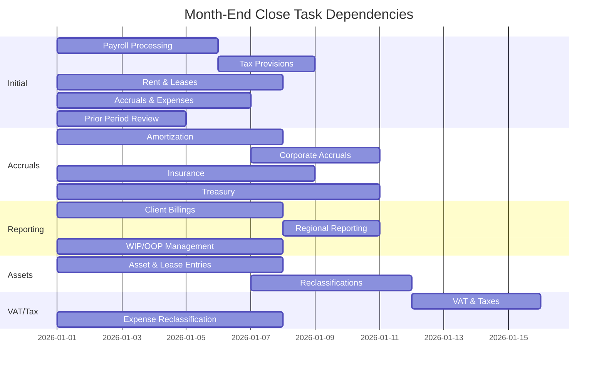

# AFC Seed Data Module

## Overview

The `afc_seed_data` module provides production-ready seed data for month-end closing tasks, loading all spreadsheet-defined data into Odoo. This includes task categories, dependencies, GL account mappings, tax filing schedules, SoD approval matrices, and Philippine holiday calendars.

## Module Structure

```
afc_seed_data/
├── __init__.py
├── __manifest__.py
├── models/
│   └── __init__.py
├── security/
│   └── ir.model.access.csv
└── data/
    ├── closing_task_categories.xml
    ├── task_dependencies.xml
    ├── gl_account_mapping.xml
    ├── tax_filing_schedule.xml
    ├── sod_approval_matrix.xml
    └── holidays_calendar.xml
```

## Manifest

```python
{
    'name': 'AFC - Seed Data (Month-End Closing Tasks)',
    'version': '18.0.1.0.0',
    'category': 'Accounting',
    'depends': ['afc_core', 'afc_philippines', 'afc_grc'],
    'data': [
        'security/ir.model.access.csv',
        'data/closing_task_categories.xml',
        'data/task_dependencies.xml',
        'data/gl_account_mapping.xml',
        'data/tax_filing_schedule.xml',
        'data/sod_approval_matrix.xml',
        'data/holidays_calendar.xml',
    ],
    'installable': True,
    'auto_install': False,
    'author': 'InsightPulse AI',
    'license': 'LGPL-3',
}
```

---

## Task Categories

### I. Initial & Compliance Section

| Code | Category | Department | Due Offset | Four-Eyes | Approver |
|------|----------|------------|------------|-----------|----------|
| `PAYROLL` | Payroll Processing & Tax Provision | RIM | Day 5 | Yes | Manager |
| `TAX_PROV` | Tax & Provisions | RIM | Day 5 | Yes | Director |
| `RENT_LEASE` | Rent & Leases | BOM | Day 7 | No | Manager |
| `ACCRUALS_EXP` | Accruals & Expenses | BOM | Day 6 | Yes | Manager |
| `PRIOR_PERIOD` | Prior Period Review | BOM | Day 4 | Yes | Manager |

### II. Accruals & Amortization Section

| Code | Category | Department | Due Offset | Four-Eyes | Approver |
|------|----------|------------|------------|-----------|----------|
| `AMORT_CORP` | Amortization & Corporate | JPAL | Day 7 | No | Manager |
| `CORP_ACCRUALS` | Corporate Accruals | BOM | Day 6 | Yes | Director |
| `INSURANCE` | Insurance | BOM | Day 8 | No | Manager |
| `TREASURY` | Treasury & Other | LAS | Day 10 | Yes | Manager |

### III. Reporting Section

| Code | Category | Department | Due Offset | Four-Eyes | Approver |
|------|----------|------------|------------|-----------|----------|
| `REGIONAL_RPT` | Regional Reporting | RMQB | Day 8 | No | Manager |
| `CLIENT_BILL` | Client Billings | JAP | Day 7 | Yes | Manager |
| `WIP_OOP` | WIP/OOP Management | LAS | Day 7 | Yes | Manager |

### IV. Aging & Liquidation Section

| Code | Category | Department | Due Offset | Four-Eyes | Approver |
|------|----------|------------|------------|-----------|----------|
| `AR_AGING` | AR Aging - Working Capital | JAP | Day 8 | No | Manager |
| `CA_LIQ` | CA Liquidations - Working Capital | RIM | Day 5 | Yes | Manager |
| `AP_AGING` | AP Aging - Working Capital | JAP | Day 8 | No | Manager |
| `OOP` | OOP - Operating Overhead Project | LAS | Day 8 | No | Manager |

### V. Assets & Reclassification Section

| Code | Category | Department | Due Offset | Four-Eyes | Approver |
|------|----------|------------|------------|-----------|----------|
| `ASSET_LEASE` | Asset & Lease Entries | JPAL | Day 7 | Yes | Manager |
| `RECLASSIFY` | Reclassifications | RIM | Day 7 | Yes | Director |

### VI. VAT & Tax Section

| Code | Category | Department | Due Offset | Four-Eyes | Approver |
|------|----------|------------|------------|-----------|----------|
| `VAT_TAXES` | VAT & Taxes | RMQB | Day 7 | No | Manager |
| `EXP_RECLASSIFY` | Expense Reclassification | JPAL | Day 7 | Yes | Manager |

### VII. Accruals & Aging Section

| Code | Category | Department | Due Offset | Four-Eyes | Approver |
|------|----------|------------|------------|-----------|----------|
| `ACCRUALS_ASSETS` | Accruals & Assets | JPAL | Day 7 | No | Manager |
| `CELLPHONE` | Cellphone Allowance | RIM | Day 5 | No | Manager |

### VIII. Job Transfer & WIP Section

| Code | Category | Department | Due Offset | Four-Eyes | Approver |
|------|----------|------------|------------|-----------|----------|
| `JOB_TRANSFER` | Job Transfers | JLI | Day 7 | Yes | Manager |
| `AP_AGING_INV` | AP Aging - Invoice Status | JAP | Day 8 | No | Manager |
| `CA_LIQ_EMP` | CA Liquidations - Employee | RIM | Day 5 | Yes | Manager |
| `ACCRUALS_REV` | Accruals - Revenue Fees | JRMO | Day 7 | No | Manager |
| `WIP_SCHEDULE` | WIP Schedule | JRMO | Day 8 | No | Manager |

---

## Task Dependencies (Gantt Chart)



### Dependency Rules

| Task | Blocked By |
|------|------------|
| Tax Provisions | Payroll Processing |
| Reclassifications | Accruals & Expenses, Accruals & Assets |
| Regional Reporting | Client Billings |
| VAT & Taxes | Expense Reclassification |

---

## GL Account Mapping

Each task category is mapped to specific GL accounts for automated journal entries:

| Task Category | Expense Account | Payable/Asset Account |
|---------------|-----------------|----------------------|
| Payroll | 5000-1 (Payroll Expense) | 2100-1 (Payroll Payable) |
| Tax Provisions | 5100-1 (Tax Expense) | 2200-1 (Tax Payable) |
| Rent & Leases | 4500-1 (Rental Income) | 2050-1 (Rental Payable) |
| Accruals & Expenses | 5200-1 (Accrued Expenses) | 2300-1 (Accrued Payable) |
| Amortization | 5300-1 (Amortization) | 1500-1 (Accum. Amortization) |
| Insurance | 5250-1 (Insurance Expense) | 2250-1 (Insurance Payable) |
| Client Billings | 1300-1 (Client Receivables) | 4100-1 (Client Revenue) |
| WIP/OOP | 1250-1 (WIP Assets) | 5400-1 (WIP Expense) |
| AR Aging | 1200-1 (Accounts Receivable) | - |
| AP Aging | 2100-1 (Accounts Payable) | - |
| Assets & Leases | 1500-1 (Fixed Assets) | 2500-1 (Lease Payable) |
| VAT & Taxes | 2800-1 (VAT Payable) | 4300-1 (VAT Expense) |

---

## Tax Filing Schedule

### Monthly BIR Forms

| Form | Description | Filing Deadline | Payment Deadline |
|------|-------------|-----------------|------------------|
| 1601-C | Monthly Remittance - Creditable WHT | 10th of following month | 10th of following month |
| 2550Q | Quarterly VAT Return | 27th after quarter end | 27th after quarter end |

### Annual BIR Forms

| Form | Description | Filing Deadline |
|------|-------------|-----------------|
| 1702 | Annual Income Tax Return | April 15 |
| 1702-EQ | Annual EWT | April 15 |
| 1601-EQ | Quarterly EWT | 15th after quarter end |

### Sample Tax Calendar Records

```xml
<!-- BIR Form 1601-C - January 2026 -->
<record id="bir_form_1601c_jan" model="afc.tax_filing_schedule">
    <field name="name">1601-C - January 2026</field>
    <field name="form_type">1601-C</field>
    <field name="period_start">2026-01-01</field>
    <field name="period_end">2026-01-31</field>
    <field name="filing_deadline">2026-02-10</field>
    <field name="payment_deadline">2026-02-10</field>
    <field name="status">draft</field>
    <field name="required_approver_role">manager</field>
</record>

<!-- BIR Form 2550Q - Q1 2026 -->
<record id="bir_form_2550q_q1" model="afc.tax_filing_schedule">
    <field name="name">2550Q - Q1 2026 (Jan-Mar)</field>
    <field name="form_type">2550Q</field>
    <field name="period_start">2026-01-01</field>
    <field name="period_end">2026-03-31</field>
    <field name="filing_deadline">2026-04-27</field>
    <field name="payment_deadline">2026-04-27</field>
    <field name="status">draft</field>
    <field name="required_approver_role">manager</field>
</record>
```

---

## Separation of Duties (SoD) Approval Matrix

### Role Structure

Each task follows the Four-Eyes Principle with three distinct roles:

```
┌─────────────┐      ┌─────────────┐      ┌─────────────┐
│  PREPARER   │ ──▶  │  REVIEWER   │ ──▶  │  APPROVER   │
│ (Execute)   │      │  (Review)   │      │  (Approve)  │
│ Employee    │      │ Supervisor  │      │  Manager+   │
└─────────────┘      └─────────────┘      └─────────────┘
      ≠                    ≠                    ≠
 (Must be different persons - Four-Eyes Principle)
```

### SoD Roles by Task Category

| Task | Preparer | Reviewer | Approver |
|------|----------|----------|----------|
| Payroll | RIM Employee | RIM Supervisor | Finance Manager |
| Tax Provisions | RIM Employee | Finance Manager | CFO (Director) |
| Accruals | BOM Employee | BOM Supervisor | Finance Manager |
| Reclassifications | RIM Employee | Finance Manager | Finance Director |
| Client Billings | JAP Employee | Finance Manager | Finance Manager |
| WIP/OOP | LAS Employee | Finance Manager | Finance Manager |
| CA Liquidations | RIM Employee | Finance Manager | Finance Manager |
| Job Transfers | JLI Employee | Finance Manager | Finance Manager |

### SoD Conflict Rules

| Rule | Type | Severity | Description |
|------|------|----------|-------------|
| Four-Eyes: Preparer ≠ Reviewer | `cannot_be_same_person` | Critical | Preparer and Reviewer must be different |
| Four-Eyes: Preparer ≠ Approver | `cannot_be_same_person` | Critical | Preparer and Approver must be different |
| Four-Eyes: Reviewer ≠ Approver | `cannot_be_same_person` | Critical | Reviewer and Approver must be different |
| Department Separation | `different_department_required` | High | GL posting requires cross-department review |
| Amount Threshold | `amount_threshold` | High | Transactions >₱50,000 require CFO approval |

### Sample SoD Role Record

```xml
<record id="sod_payroll_preparer" model="afc.sod_role">
    <field name="name">Payroll Preparer (RIM)</field>
    <field name="code">PAYROLL_PREP_RIM</field>
    <field name="task_category_id" ref="task_category_payroll"/>
    <field name="allowed_actions">execute</field>
    <field name="department">RIM</field>
    <field name="min_level">employee</field>
</record>

<record id="sod_payroll_reviewer" model="afc.sod_role">
    <field name="name">Payroll Reviewer (RIM)</field>
    <field name="code">PAYROLL_REV_RIM</field>
    <field name="task_category_id" ref="task_category_payroll"/>
    <field name="allowed_actions">review</field>
    <field name="department">RIM</field>
    <field name="min_level">supervisor</field>
    <field name="must_differ_from">PAYROLL_PREP_RIM</field>
</record>

<record id="sod_payroll_approver" model="afc.sod_role">
    <field name="name">Payroll Approver (Finance)</field>
    <field name="code">PAYROLL_APP_FIN</field>
    <field name="task_category_id" ref="task_category_payroll"/>
    <field name="allowed_actions">approve</field>
    <field name="department">Finance</field>
    <field name="min_level">manager</field>
    <field name="must_differ_from">PAYROLL_PREP_RIM,PAYROLL_REV_RIM</field>
</record>
```

---

## Philippine Holidays Calendar (2025-2027)

### 2026 Legal Holidays

| Date | Holiday |
|------|---------|
| January 1 | New Year's Day |
| February 25 | EDSA Revolution Anniversary |
| April 2 | Maundy Thursday |
| April 3 | Good Friday |
| April 9 | Araw ng Kagitingan |
| May 1 | Labor Day |
| May 27 | Eid'l Adha |
| June 12 | Independence Day |
| August 21 | Ninoy Aquino Day |
| August 31 | National Heroes Day |
| November 1 | All Saints' Day |
| November 30 | Bonifacio Day |
| December 25 | Christmas Day |
| December 30 | Rizal Day |

### 2026 Special Non-Working Holidays

| Date | Holiday |
|------|---------|
| February 17 | Chinese New Year |
| April 4 | Black Saturday |
| November 2 | All Souls' Day |
| December 24 | Christmas Eve |

### Holiday Impact on Close Calendar

The close calendar automatically adjusts due dates when they fall on holidays:

```python
# Example: Due date adjustment logic
def adjust_due_date(due_date, holidays):
    while due_date in holidays or due_date.weekday() >= 5:
        due_date -= timedelta(days=1)
    return due_date
```

---

## Security Configuration

### Access Control

```csv
id,name,model_id:id,group_id:id,perm_read,perm_write,perm_create,perm_unlink
access_task_category_user,afc.task_category user,afc_core.model_afc_task_category,base.group_user,1,0,0,0
access_task_category_manager,afc.task_category manager,afc_core.model_afc_task_category,account.group_account_manager,1,1,1,0
access_closing_task_user,afc.closing_task user,afc_core.model_afc_closing_task,base.group_user,1,1,1,0
access_closing_task_manager,afc.closing_task manager,afc_core.model_afc_closing_task,account.group_account_manager,1,1,1,1
access_tax_filing_user,afc.tax_filing_schedule user,afc_philippines.model_afc_tax_filing_schedule,base.group_user,1,0,0,0
access_tax_filing_manager,afc.tax_filing_schedule manager,afc_philippines.model_afc_tax_filing_schedule,account.group_account_manager,1,1,1,1
```

---

## Installation

### Step 1: Deploy Module

```bash
cd /opt/odoo/addons
git clone <your-repo> afc_seed_data
# OR copy the folder manually
```

### Step 2: Install via Odoo UI

1. Go to **Settings → Apps**
2. Click **Update Apps List**
3. Search for "AFC - Seed Data"
4. Click **Install**

### Step 3: Verify Data Loaded

```python
# In Odoo shell:
./odoo-bin shell -d odoo

>>> env['afc.task_category'].search_count([])
# Expected: 25

>>> env['resource.holiday'].search_count([])
# Expected: 25+

>>> env['afc.sod_role'].search_count([])
# Expected: 30+
```

---

## Usage

### Create Close Period

1. Navigate to **Accounting → Close Calendar → Periods**
2. Click **Create**
3. Select period type (Monthly/Quarterly/Annual)
4. Set period dates (e.g., December 2025)
5. Click **Generate Tasks**

### Task Workflow

```
┌──────────┐    ┌───────────┐    ┌──────────┐    ┌───────────┐
│  Draft   │───▶│ Assigned  │───▶│ In Work  │───▶│  Review   │
└──────────┘    └───────────┘    └───────────┘    └───────────┘
                                                       │
                                                       ▼
                                               ┌───────────┐
                                               │ Approved  │
                                               └───────────┘
```

### Track Progress

- View Gantt chart: **Close Calendar → Gantt View**
- View task board: **Close Calendar → Kanban View**
- Export status report: **Close Calendar → Reports → Status Report**

---

## Data Summary

| Data Type | Record Count | Source |
|-----------|--------------|--------|
| Task Categories | 25 | Closing Task spreadsheet |
| Task Dependencies | 4 | Gantt chart |
| GL Account Mappings | 20+ | Chart of Accounts |
| Tax Filing Schedules | 10+ | BIR calendar |
| SoD Roles | 30+ | Approval matrix |
| Philippine Holidays | 25+ | 2025-2027 calendar |

---

## Production Deployment Checklist

- [ ] Module installed in `/opt/odoo/addons/afc_seed_data`
- [ ] `__manifest__.py` depends on: `afc_core`, `afc_philippines`, `afc_grc`
- [ ] All XML files in `/data/` folder
- [ ] Security CSV permissions configured
- [ ] Module installed via Odoo Apps
- [ ] 25 task categories loaded
- [ ] SoD roles configured (30+ roles)
- [ ] Tax filing schedule active
- [ ] Holiday calendar populated
- [ ] Tested: Create close calendar → Generate tasks
- [ ] Tested: Assign tasks → Track completion
- [ ] Tested: SoD conflicts detected on assignment
- [ ] Tested: Four-Eyes Principle enforced
