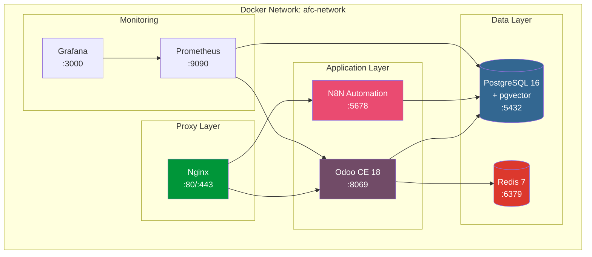

# Docker Deployment Guide

## Overview

This guide covers Docker and Docker Compose deployment for the AFC Odoo modules, including PostgreSQL with pgvector, Redis, N8N workflow automation, and monitoring stack.

## Architecture



## Docker Compose Configuration

### Development Environment

```yaml
# docker-compose.yml
version: '3.8'

services:
  # ============================================
  # PostgreSQL 16 with pgvector extension
  # ============================================
  postgres:
    image: pgvector/pgvector:pg16
    container_name: afc-postgres
    restart: unless-stopped
    environment:
      POSTGRES_USER: ${POSTGRES_USER:-odoo}
      POSTGRES_PASSWORD: ${POSTGRES_PASSWORD:-odoo}
      POSTGRES_DB: ${POSTGRES_DB:-odoo}
      PGDATA: /var/lib/postgresql/data/pgdata
    volumes:
      - postgres_data:/var/lib/postgresql/data
      - ./docker/postgres/init.sql:/docker-entrypoint-initdb.d/init.sql:ro
    ports:
      - "5432:5432"
    networks:
      - afc-network
    healthcheck:
      test: ["CMD-SHELL", "pg_isready -U ${POSTGRES_USER:-odoo} -d ${POSTGRES_DB:-odoo}"]
      interval: 10s
      timeout: 5s
      retries: 5

  # ============================================
  # Redis 7 for caching and sessions
  # ============================================
  redis:
    image: redis:7-alpine
    container_name: afc-redis
    restart: unless-stopped
    command: redis-server --appendonly yes --maxmemory 256mb --maxmemory-policy allkeys-lru
    volumes:
      - redis_data:/data
    ports:
      - "6379:6379"
    networks:
      - afc-network
    healthcheck:
      test: ["CMD", "redis-cli", "ping"]
      interval: 10s
      timeout: 5s
      retries: 5

  # ============================================
  # Odoo CE 18 with AFC modules
  # ============================================
  odoo:
    build:
      context: .
      dockerfile: docker/Dockerfile
    container_name: afc-odoo
    restart: unless-stopped
    depends_on:
      postgres:
        condition: service_healthy
      redis:
        condition: service_healthy
    environment:
      - HOST=postgres
      - PORT=5432
      - USER=${POSTGRES_USER:-odoo}
      - PASSWORD=${POSTGRES_PASSWORD:-odoo}
      - ODOO_RC=/etc/odoo/odoo.conf
      # AFC-specific environment
      - AFC_SOD_STRICT_MODE=${AFC_SOD_STRICT_MODE:-true}
      - AFC_AUDIT_RETENTION_DAYS=${AFC_AUDIT_RETENTION_DAYS:-2555}
      - AFC_COPILOT_API_KEY=${AFC_COPILOT_API_KEY:-}
      - AFC_COPILOT_MODEL=${AFC_COPILOT_MODEL:-claude-sonnet-4-20250514}
      - AFC_BIR_REMINDER_DAYS=${AFC_BIR_REMINDER_DAYS:-7,3,1}
    volumes:
      - odoo_data:/var/lib/odoo
      - odoo_config:/etc/odoo
      - ./addons:/mnt/extra-addons:ro
    ports:
      - "8069:8069"
      - "8072:8072"  # Longpolling
    networks:
      - afc-network
    healthcheck:
      test: ["CMD", "curl", "-f", "http://localhost:8069/web/health"]
      interval: 30s
      timeout: 10s
      retries: 3
      start_period: 60s

  # ============================================
  # N8N Workflow Automation
  # ============================================
  n8n:
    image: n8nio/n8n:latest
    container_name: afc-n8n
    restart: unless-stopped
    depends_on:
      postgres:
        condition: service_healthy
    environment:
      - N8N_BASIC_AUTH_ACTIVE=true
      - N8N_BASIC_AUTH_USER=${N8N_USER:-admin}
      - N8N_BASIC_AUTH_PASSWORD=${N8N_PASSWORD:-changeme}
      - N8N_HOST=${N8N_HOST:-localhost}
      - N8N_PORT=5678
      - N8N_PROTOCOL=https
      - WEBHOOK_URL=${N8N_WEBHOOK_URL:-https://n8n.example.com/}
      - DB_TYPE=postgresdb
      - DB_POSTGRESDB_HOST=postgres
      - DB_POSTGRESDB_PORT=5432
      - DB_POSTGRESDB_DATABASE=n8n
      - DB_POSTGRESDB_USER=${POSTGRES_USER:-odoo}
      - DB_POSTGRESDB_PASSWORD=${POSTGRES_PASSWORD:-odoo}
      - EXECUTIONS_DATA_PRUNE=true
      - EXECUTIONS_DATA_MAX_AGE=168  # 7 days
      - GENERIC_TIMEZONE=${TZ:-Asia/Manila}
    volumes:
      - n8n_data:/home/node/.n8n
    ports:
      - "5678:5678"
    networks:
      - afc-network
    healthcheck:
      test: ["CMD", "wget", "-q", "--spider", "http://localhost:5678/healthz"]
      interval: 30s
      timeout: 10s
      retries: 3

  # ============================================
  # Nginx Reverse Proxy
  # ============================================
  nginx:
    image: nginx:alpine
    container_name: afc-nginx
    restart: unless-stopped
    depends_on:
      - odoo
      - n8n
    volumes:
      - ./docker/nginx/default.conf:/etc/nginx/conf.d/default.conf:ro
      - ./docker/nginx/ssl:/etc/nginx/ssl:ro
    ports:
      - "80:80"
      - "443:443"
    networks:
      - afc-network
    healthcheck:
      test: ["CMD", "nginx", "-t"]
      interval: 30s
      timeout: 10s
      retries: 3

networks:
  afc-network:
    driver: bridge

volumes:
  postgres_data:
  redis_data:
  odoo_data:
  odoo_config:
  n8n_data:
```

### Production Environment

```yaml
# docker-compose.prod.yml
version: '3.8'

services:
  postgres:
    deploy:
      resources:
        limits:
          cpus: '4'
          memory: 8G
        reservations:
          cpus: '2'
          memory: 4G
    environment:
      - POSTGRES_INITDB_ARGS=--data-checksums
    command: >
      postgres
      -c max_connections=200
      -c shared_buffers=2GB
      -c effective_cache_size=6GB
      -c maintenance_work_mem=512MB
      -c checkpoint_completion_target=0.9
      -c wal_buffers=64MB
      -c default_statistics_target=100
      -c random_page_cost=1.1
      -c effective_io_concurrency=200
      -c work_mem=10485kB
      -c min_wal_size=1GB
      -c max_wal_size=4GB
      -c max_worker_processes=4
      -c max_parallel_workers_per_gather=2
      -c max_parallel_workers=4
      -c max_parallel_maintenance_workers=2

  odoo:
    deploy:
      replicas: 3
      resources:
        limits:
          cpus: '2'
          memory: 4G
        reservations:
          cpus: '1'
          memory: 2G
    environment:
      - WORKERS=4
      - MAX_CRON_THREADS=2
      - LIMIT_MEMORY_HARD=2684354560
      - LIMIT_MEMORY_SOFT=2147483648
      - LIMIT_TIME_CPU=600
      - LIMIT_TIME_REAL=1200
      - LIMIT_TIME_REAL_CRON=3600
    command: >
      odoo
      --workers=4
      --max-cron-threads=2
      --limit-memory-hard=2684354560
      --limit-memory-soft=2147483648
      --limit-time-cpu=600
      --limit-time-real=1200

  n8n:
    deploy:
      resources:
        limits:
          cpus: '2'
          memory: 2G
        reservations:
          cpus: '1'
          memory: 1G
    environment:
      - EXECUTIONS_PROCESS=main
      - EXECUTIONS_TIMEOUT=3600
      - EXECUTIONS_TIMEOUT_MAX=7200

  # ============================================
  # Prometheus Monitoring
  # ============================================
  prometheus:
    image: prom/prometheus:latest
    container_name: afc-prometheus
    restart: unless-stopped
    volumes:
      - ./docker/prometheus/prometheus.yml:/etc/prometheus/prometheus.yml:ro
      - prometheus_data:/prometheus
    command:
      - '--config.file=/etc/prometheus/prometheus.yml'
      - '--storage.tsdb.path=/prometheus'
      - '--storage.tsdb.retention.time=30d'
      - '--web.enable-lifecycle'
    ports:
      - "9090:9090"
    networks:
      - afc-network

  # ============================================
  # Grafana Dashboards
  # ============================================
  grafana:
    image: grafana/grafana:latest
    container_name: afc-grafana
    restart: unless-stopped
    depends_on:
      - prometheus
    environment:
      - GF_SECURITY_ADMIN_USER=${GRAFANA_USER:-admin}
      - GF_SECURITY_ADMIN_PASSWORD=${GRAFANA_PASSWORD:-changeme}
      - GF_USERS_ALLOW_SIGN_UP=false
      - GF_SERVER_ROOT_URL=${GRAFANA_URL:-http://localhost:3000}
    volumes:
      - grafana_data:/var/lib/grafana
      - ./docker/grafana/provisioning:/etc/grafana/provisioning:ro
    ports:
      - "3000:3000"
    networks:
      - afc-network

volumes:
  prometheus_data:
  grafana_data:
```

## Dockerfile

```dockerfile
# docker/Dockerfile
FROM odoo:18.0

USER root

# Install system dependencies
RUN apt-get update && apt-get install -y --no-install-recommends \
    build-essential \
    libpq-dev \
    python3-dev \
    git \
    curl \
    && rm -rf /var/lib/apt/lists/*

# Install Python dependencies for AFC modules
COPY requirements.txt /tmp/requirements.txt
RUN pip3 install --no-cache-dir -r /tmp/requirements.txt

# Install OCA modules
RUN pip3 install --no-cache-dir \
    odoo-addon-auditlog \
    odoo-addon-project_task_dependency \
    odoo-addon-account_financial_report \
    odoo-addon-account_move_tier_validation

# Copy AFC custom modules
COPY addons/afc_close_manager /mnt/extra-addons/afc_close_manager
COPY addons/afc_close_manager_ph /mnt/extra-addons/afc_close_manager_ph
COPY addons/afc_sod_controls /mnt/extra-addons/afc_sod_controls
COPY addons/afc_rag_copilot /mnt/extra-addons/afc_rag_copilot

# Set permissions
RUN chown -R odoo:odoo /mnt/extra-addons

# Copy Odoo configuration
COPY docker/odoo.conf /etc/odoo/odoo.conf

USER odoo

# Default command
CMD ["odoo"]
```

## Configuration Files

### Odoo Configuration

```ini
# docker/odoo.conf
[options]
addons_path = /mnt/extra-addons,/usr/lib/python3/dist-packages/odoo/addons
data_dir = /var/lib/odoo
admin_passwd = ${ODOO_ADMIN_PASSWD:-admin}

# Database
db_host = postgres
db_port = 5432
db_user = odoo
db_password = odoo
db_name = odoo
db_sslmode = prefer

# Performance
workers = 4
max_cron_threads = 2
limit_memory_hard = 2684354560
limit_memory_soft = 2147483648
limit_time_cpu = 600
limit_time_real = 1200
limit_time_real_cron = 3600

# Proxy
proxy_mode = True
longpolling_port = 8072

# Logging
log_level = info
log_handler = :INFO
logfile = /var/log/odoo/odoo.log

# Security
list_db = False
```

### Nginx Configuration

```nginx
# docker/nginx/default.conf
upstream odoo {
    server odoo:8069;
}

upstream odoo-longpolling {
    server odoo:8072;
}

upstream n8n {
    server n8n:5678;
}

# HTTP redirect to HTTPS
server {
    listen 80;
    server_name _;
    return 301 https://$host$request_uri;
}

# Main HTTPS server
server {
    listen 443 ssl http2;
    server_name odoo.example.com;

    ssl_certificate /etc/nginx/ssl/fullchain.pem;
    ssl_certificate_key /etc/nginx/ssl/privkey.pem;
    ssl_session_timeout 30m;
    ssl_protocols TLSv1.2 TLSv1.3;
    ssl_ciphers ECDHE-ECDSA-AES128-GCM-SHA256:ECDHE-RSA-AES128-GCM-SHA256;
    ssl_prefer_server_ciphers off;

    # Proxy headers
    proxy_set_header Host $host;
    proxy_set_header X-Real-IP $remote_addr;
    proxy_set_header X-Forwarded-For $proxy_add_x_forwarded_for;
    proxy_set_header X-Forwarded-Proto $scheme;

    # Timeouts
    proxy_connect_timeout 720s;
    proxy_send_timeout 720s;
    proxy_read_timeout 720s;

    # Gzip
    gzip on;
    gzip_types text/css text/plain text/xml application/xml application/javascript application/json;

    # Longpolling
    location /longpolling {
        proxy_pass http://odoo-longpolling;
    }

    # Odoo main
    location / {
        proxy_pass http://odoo;
        proxy_redirect off;

        # Large file uploads
        client_max_body_size 100M;
    }

    # Static files cache
    location ~* /web/static/ {
        proxy_pass http://odoo;
        expires 30d;
        add_header Cache-Control "public, immutable";
    }
}

# N8N server
server {
    listen 443 ssl http2;
    server_name n8n.example.com;

    ssl_certificate /etc/nginx/ssl/fullchain.pem;
    ssl_certificate_key /etc/nginx/ssl/privkey.pem;

    location / {
        proxy_pass http://n8n;
        proxy_set_header Host $host;
        proxy_set_header X-Real-IP $remote_addr;
        proxy_set_header X-Forwarded-For $proxy_add_x_forwarded_for;
        proxy_set_header X-Forwarded-Proto $scheme;

        # WebSocket support for N8N
        proxy_http_version 1.1;
        proxy_set_header Upgrade $http_upgrade;
        proxy_set_header Connection "upgrade";
    }
}
```

### PostgreSQL Initialization

```sql
-- docker/postgres/init.sql

-- Create pgvector extension
CREATE EXTENSION IF NOT EXISTS vector;

-- Create N8N database
CREATE DATABASE n8n;

-- AFC-specific indexes for audit performance
-- (Applied after Odoo module installation)

-- Create function for immutable audit trail
CREATE OR REPLACE FUNCTION prevent_audit_modification()
RETURNS TRIGGER AS $$
BEGIN
    IF TG_OP = 'UPDATE' OR TG_OP = 'DELETE' THEN
        RAISE EXCEPTION 'Audit trail records cannot be modified or deleted';
    END IF;
    RETURN NEW;
END;
$$ LANGUAGE plpgsql;
```

## Environment Variables

Create a `.env` file for deployment:

```bash
# .env

# PostgreSQL
POSTGRES_USER=odoo
POSTGRES_PASSWORD=your-secure-password-here
POSTGRES_DB=odoo

# Odoo
ODOO_ADMIN_PASSWD=your-admin-password-here

# AFC Configuration
AFC_SOD_STRICT_MODE=true
AFC_AUDIT_RETENTION_DAYS=2555
AFC_COPILOT_API_KEY=sk-ant-api03-xxx
AFC_COPILOT_MODEL=claude-sonnet-4-20250514
AFC_BIR_REMINDER_DAYS=7,3,1

# N8N
N8N_USER=admin
N8N_PASSWORD=your-n8n-password-here
N8N_HOST=n8n.example.com
N8N_WEBHOOK_URL=https://n8n.example.com/

# Monitoring
GRAFANA_USER=admin
GRAFANA_PASSWORD=your-grafana-password-here
GRAFANA_URL=https://grafana.example.com

# Timezone
TZ=Asia/Manila
```

## Deployment Commands

### Initial Setup

```bash
# Clone repository
git clone https://github.com/jgtolentino/odoo-ce-close-mono.git
cd odoo-ce-close-mono

# Create environment file
cp .env.example .env
# Edit .env with your values

# Build and start services
docker-compose build
docker-compose up -d

# Initialize Odoo database
docker-compose exec odoo odoo -i base -d odoo --stop-after-init

# Install AFC modules
docker-compose exec odoo odoo -i afc_close_manager,afc_close_manager_ph,afc_sod_controls,afc_rag_copilot -d odoo --stop-after-init

# Restart Odoo
docker-compose restart odoo
```

### Production Deployment

```bash
# Use production compose file
docker-compose -f docker-compose.yml -f docker-compose.prod.yml up -d

# Scale Odoo workers
docker-compose -f docker-compose.yml -f docker-compose.prod.yml up -d --scale odoo=3

# View logs
docker-compose logs -f odoo

# Backup database
docker-compose exec postgres pg_dump -U odoo odoo > backup_$(date +%Y%m%d).sql
```

### Health Checks

```bash
# Check all services
docker-compose ps

# Check Odoo health
curl -f http://localhost:8069/web/health

# Check PostgreSQL
docker-compose exec postgres pg_isready -U odoo

# Check Redis
docker-compose exec redis redis-cli ping

# Check N8N
curl -f http://localhost:5678/healthz
```

## Kubernetes Deployment

For Kubernetes deployment, see the Helm chart in `charts/afc-odoo/`:

```bash
# Install Helm chart
helm install afc-odoo ./charts/afc-odoo \
  --namespace afc \
  --create-namespace \
  --values values.production.yaml
```

Key Helm values:

```yaml
# values.production.yaml
odoo:
  replicaCount: 3
  resources:
    limits:
      cpu: 2000m
      memory: 4Gi
    requests:
      cpu: 1000m
      memory: 2Gi

postgresql:
  enabled: true
  primary:
    resources:
      limits:
        cpu: 4000m
        memory: 8Gi
  volumePermissions:
    enabled: true
  metrics:
    enabled: true

redis:
  enabled: true
  architecture: standalone
  auth:
    enabled: true

ingress:
  enabled: true
  className: nginx
  annotations:
    cert-manager.io/cluster-issuer: letsencrypt-prod
  hosts:
    - host: odoo.example.com
      paths:
        - path: /
          pathType: Prefix
  tls:
    - secretName: odoo-tls
      hosts:
        - odoo.example.com
```
